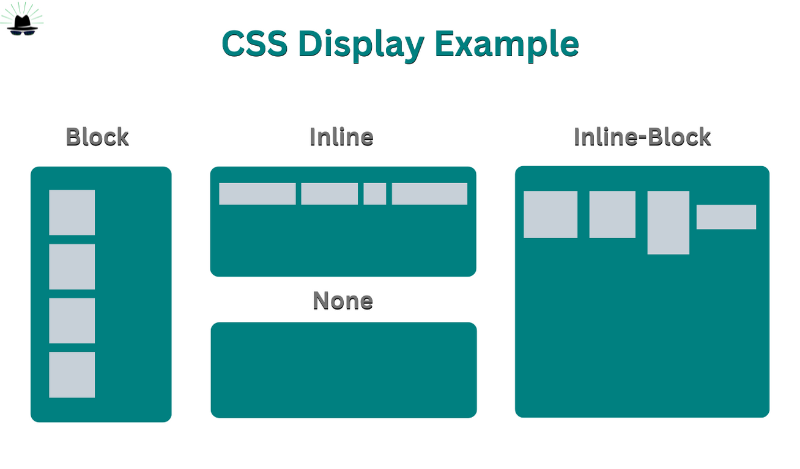

# CSS(Cascading Style Sheets)

- 웹 페이지의 디자인과 레이아웃을 정의하기 위한 스타일 시트 언어를 의미합니다. CSS는 HTML 및 다른 마크업 언어로 작성된 문서의 스타일을 지정하여 콘텐츠의 모양, 크기, 색상, 레이아웃 등을 제어하는 데 사용됩니다.

- "Cascading"이라는 용어는 스타일 규칙이 우선순위에 따라 적용되는 방식을 설명하는데 사용됩니다. CSS는 웹 페이지를 더욱 매력적이고 사용자 친화적으로 만드는 데 중요한 역할을 합니다.

<br>

### CSS의 Cascading

- CSS에서 Cascading은 스타일 규칙이 어떻게 적용되는지를 나타내는 개념입니다. Cascading은 여러 스타일 규칙이 동일한 요소에 적용될 때, 이러한 규칙들이 결합되어 최종적으로 적용되는 스타일을 결정하는 프로세스를 말합니다.

1. 상속 (Inheritance)

- CSS에서는 일부 속성들이 부모 요소로부터 자식 요소로 상속됩니다. 예를 들어, 부모 요소에 적용된 폰트 스타일이 자식 요소에도 적용될 수 있습니다. 상속되는 속성은 color, font-family, font-size 등이 있습니다.

2. 우선순위 (Specificity)

- 여러 스타일 규칙이 동일한 요소에 적용될 때, 각 규칙의 우선순위에 따라 결정됩니다. 일반적으로 구체적인 선택자가 더 높은 우선순위를 가지며, 우선순위가 동일한 경우에는 나중에 선언된 규칙이 우선합니다. 이를 통해 개발자는 원하는 스타일이 적용되도록 제어할 수 있습니다.

3. 선언 순서 (Declaration Order)

- 스타일 규칙이 동일한 우선순위를 가지고 있고, 상속되는 속성도 아닌 경우에는 선언된 순서에 따라 결정됩니다. 나중에 선언된 규칙이 먼저 선언된 규칙을 덮어씁니다.

<br>

- Cascading의 개념을 이해하고 활용하여 CSS를 작성하면 요소에 일관된 스타일을 적용하고, 스타일 충돌을 방지하며, 원하는 스타일을 정확하게 제어할 수 있습니다.

<br>

### CSS의 주요 컴포넌트

1. 스타일 규칙(Style Rules): 스타일 규칙은 선택자(selector)와 스타일 속성(property) 및 값(value)으로 구성됩니다. 선택자는 HTML 요소를 선택하고, 해당 요소에 적용할 스타일을 지정합니다. 스타일 속성은 요소의 외관이나 동작을 정의하고, 값은 속성의 특정 설정을 나타냅니다.

2. 선택자(Selectors): 선택자는 HTML 문서 내에서 스타일을 적용할 요소를 선택하는 방법을 지정합니다. 선택자는 요소의 태그 이름, 클래스, ID, 속성 등을 기반으로 지정할 수 있습니다. 선택자를 사용하여 특정 요소 또는 요소 그룹에 스타일을 적용할 수 있습니다.

3. 스타일 속성(Properties) 및 값(Values): 스타일 속성은 HTML 요소의 스타일을 지정하는 데 사용되며, 이러한 속성은 일반적으로 크기, 색상, 폰트, 여백, 패딩 등과 관련이 있습니다. 각 속성은 하나 이상의 값과 함께 사용되며, 값은 속성의 설정을 정의합니다. 

- 예를 들어, "color" 속성에는 요소의 텍스트 색상을 지정하는데 사용되며, 이 속성의 값으로는 색상 이름, HEX 코드, RGB 값 등이 사용될 수 있습니다.

<br>

### CSS의 선택자(Selectors)

- CSS의 선택자는 HTML 요소를 선택하여 해당 요소에 스타일을 적용하는 데 사용됩니다. 여러 가지 유형의 선택자가 있으며, 각각의 역할과 사용법이 다릅니다. 여기에는 일반적으로 사용되는 몇 가지 선택자 유형이 있습니다

1. 태그 선택자(Tag Selector)

- HTML 요소의 태그 이름을 사용하여 해당 요소를 선택합니다. 예를 들어, "p"는 모든 단락 요소를 선택합니다.

2. 클래스 선택자(Class Selector)

- 클래스 속성을 가진 HTML 요소를 선택합니다. 클래스 선택자는 "."으로 시작하며, 클래스 이름을 지정하여 요소를 선택합니다. 예를 들어, ".btn"은 "btn" 클래스를 가진 모든 요소를 선택합니다.

3. ID 선택자(ID Selector)

- 고유한 ID 속성을 가진 HTML 요소를 선택합니다. ID 선택자는 "#"으로 시작하며, ID 값을 지정하여 요소를 선택합니다. 예를 들어, "#header"는 "header" ID를 가진 요소를 선택합니다.

4. 자식 선택자(Child Selector)

- 특정 요소의 자식 요소를 선택합니다. 자식 선택자는 부모 요소와 자식 요소를 ">"로 구분하여 표현합니다. 예를 들어, "ul > li"는 모든 `<ul>` 요소의 자식 `<li>` 요소를 선택합니다.

5. 자손 선택자(Descendant Selector)

- 특정 요소의 하위 요소를 선택합니다. 자손 선택자는 부모 요소와 하위 요소를 공백으로 구분하여 표현합니다. 예를 들어, "div p"는 모든 `<div>` 요소 안에 있는 모든 `<p>` 요소를 선택합니다.

6. 가상 클래스 선택자(Pseudo-class Selector)

- 요소의 특정 상태나 위치를 나타내는 가상 클래스를 선택합니다. 가상 클래스 선택자는 ":"으로 시작하며, 예를 들어, ":hover"는 마우스가 요소 위에 있을 때 해당 요소를 선택합니다.

7. 가상 요소 선택자(Pseudo-element Selector)

- 요소의 특정 부분에 스타일을 적용하는 가상 요소를 선택합니다. 가상 요소 선택자는 "::"으로 시작하며, 예를 들어, "::before"는 요소의 내용 앞에 가상 요소를 생성하여 스타일을 적용합니다.

<br>

- 선택자들을 조합하여 원하는 요소를 정확하게 선택하여 스타일을 적용할 수 있습니다. 선택자의 유형과 사용법을 이해하면 CSS를 더욱 효과적으로 작성할 수 있습니다.

<br>

### CSS의 상속(Inheritance)

- CSS의 상속(Inheritance)은 요소가 부모로부터 스타일을 상속받는 것을 의미합니다. 이는 부모 요소에 적용된 스타일이 자식 요소에도 적용되는 것을 말합니다. 즉, 부모 요소에 지정된 스타일이 자식 요소에게 자동으로 전달됩니다.

- 상속의 특징은 다음과 같습니다.

1. 일반적인 스타일 속성에 적용됨: 텍스트 색상, 폰트, 텍스트 스타일(굵게, 기울임, 밑줄 등), 텍스트 정렬, 리스트 스타일 등과 같은 일반적인 스타일 속성은 대부분 상속됩니다.

2. 상속되지 않는 스타일 속성: 대부분의 레이아웃 관련 속성(예: 너비, 높이, 여백, 패딩, 테두리 등)은 상속되지 않습니다. 또한, 특정 속성(예: display, position)은 상속되지 않습니다.

3. !important 규칙: !important 규칙이 적용된 스타일은 상속되지 않습니다. 즉, !important가 적용된 스타일은 해당 요소의 자식 요소에게 상속되지 않습니다.

4. 가상 요소와 가상 클래스: 일반적으로 가상 요소(::before, ::after)와 가상 클래스(:hover, :active)는 상속되지 않습니다. 그러나 몇 가지 가상 클래스는 상속될 수 있습니다(예: :link, :visited).

- 상속은 CSS를 효과적으로 작성하고 유지보수하기 쉽게 만들어줍니다. 부모 요소에 적용된 스타일을 자식 요소가 상속받기 때문에 코드를 더 간결하고 효율적으로 작성할 수 있습니다. 

- 그러나 상속을 과도하게 의존하면 원하지 않는 스타일이 적용될 수 있으므로 조심해야 합니다. 필요한 경우 상속을 사용하고, 상속되지 않아야 하는 스타일은 명시적으로 지정하여 원하는 스타일을 정확하게 제어할 수 있습니다.

<br>

### CSS 박스 모델(Box Model)

- CSS 박스 모델은 웹 페이지의 요소를 사각형 박스로 정의하고, 각각의 박스에는 여백(margin), 테두리(border), 안쪽 여백(padding), 내용(content)이라는 구성 요소를 가지고 있습니다. 이러한 구성 요소들은 각각 다음과 같은 역할을 합니다


1. 콘텐츠(Content): 박스의 실제 내용(content)을 포함합니다. 일반적으로 텍스트, 이미지, 미디어 등이 포함됩니다.

2. 패딩(Padding): 콘텐츠(content)와 테두리(border) 사이의 여백을 나타냅니다. 패딩은 콘텐츠 주위에 공간을 만들어 요소의 내용이 테두리와 가깝게 배치되도록 합니다.

3. 테두리(Border): 박스의 가장 외곽에 위치한 선입니다. 테두리는 패딩과 콘텐츠를 감싸며, 박스의 외형을 정의합니다. 테두리는 굵기(border-width), 스타일(border-style), 색상(border-color) 등으로 정의됩니다.

4. 여백(Margin): 박스와 주변 요소 사이의 공간을 나타냅니다. 여백은 해당 요소와 인접한 요소 사이의 간격을 조절하며, 요소 간의 간격을 만들어 줍니다.

- CSS 박스 모델을 이해하면 웹 페이지의 레이아웃을 조절하고 각 요소의 크기와 위치를 조절하는 데 도움이 됩니다. 이 모델을 이용하여 각 요소의 패딩, 테두리, 여백을 조절하여 원하는 디자인을 구현할 수 있습니다. 

- 또한 박스 모델은 웹 페이지의 반응형 디자인을 구현하는 데도 중요한 개념입니다.

<br>

### CSS의 Display

- CSS의 display 속성은 요소가 렌더링되는 방식을 지정합니다. 이 속성을 사용하여 요소가 블록 레벨 요소(block-level element)인지 인라인 요소(inline element)인지, 또는 플렉스(flex)나 그리드(grid) 등의 특수 레이아웃 유형을 사용하는지를 결정할 수 있습니다. 



- 주요한 display 속성 값과 각각의 역할은 다음과 같습니다.

1. block 

- 해당 요소를 블록 레벨 요소로 지정합니다. 요소는 새로운 줄에서 시작하며, 사용 가능한 가로 공간 전체를 차지합니다.

- 예시: `<div>`, `<p>`, `<header>`

2. inline

- 해당 요소를 인라인 요소로 지정합니다. 요소는 새로운 줄에서 시작하지 않고, 텍스트나 이미지와 같은 다른 인라인 요소와 함께 가로로 배치됩니다.

- 예시: `<span>`, `<a>`, `<strong>`

3. inline-block

- 해당 요소를 인라인 레벨 요소처럼 배치하되, 블록 레벨 요소처럼 내부의 컨텐츠를 가질 수 있게 합니다.

- 요소는 새로운 줄에서 시작하지 않고, 다른 인라인 요소와 함께 가로로 배치되며 내부 컨텐츠를 포함할 수 있습니다.

- 예시: `<input>`, `<button>`, `<label>`

4. none

- 해당 요소를 화면에서 숨깁니다. 요소의 공간은 사라지며 레이아웃에서 제거됩니다.

- 예시: 주로 JavaScript에서 동적으로 요소를 숨기고 표시하는 데 사용됩니다.

5. flex

- 해당 요소를 플렉스 컨테이너로 지정하여 플렉스 아이템의 레이아웃을 조정합니다. 요소를 수평 또는 수직으로 정렬하고, 간격을 조정하며, 각 아이템의 크기를 조절하는 등의 유연한 레이아웃을 구현할 수 있습니다.

6. grid

- 해당 요소를 그리드 컨테이너로 지정하여 그리드 아이템의 레이아웃을 조정합니다. 요소를 2차원 그리드로 배열하여 행과 열을 지정하고, 각 아이템의 위치와 크기를 조절하는 등의 복잡한 레이아웃을 구현할 수 있습니다.

<br>

-  display 속성 값들을 조합하여 다양한 레이아웃을 만들 수 있으며, 이는 웹 페이지의 구조와 디자인을 유연하게 조정할 수 있게 해줍니다.

<br>

### CSS의 Position

- CSS의 position 속성은 요소의 위치를 지정하는 데 사용됩니다. 요소를 문서 흐름(flow)에서 어떻게 위치시킬지를 결정하며, top, right, bottom, left와 같은 속성과 함께 사용하여 요소의 정확한 위치를 지정할 수 있습니다. 주요한 position 속성 값과 각각의 역할은 다음과 같습니다

1. static

- 요소를 문서 흐름에 따라 기본적인 위치에 배치합니다.

- static은 position 속성의 기본 값이며, 일반적으로 따로 지정하지 않아도 됩니다.

2. relative

- 요소를 자기 자신의 원래 위치를 기준으로 이동합니다. 요소의 위치를 지정하는 top, right, bottom, left 속성을 사용하여 이동할 거리를 지정할 수 있습니다.

- 자기 자신을 기준으로 상대적으로 이동하기 때문에 다른 요소의 배치에는 영향을 미치지 않습니다.

3. absolute

- 요소를 문서 상에 기준으로 설정된 가장 가까운 위치 지정 요소(relative, absolute, fixed, sticky)를 기준으로 이동합니다.

- 부모 요소 중에서 position 속성이 static이 아닌 첫 번째 요소를 찾아 그 위치를 기준으로 이동합니다. 일반적으로 부모 요소 중 하나에 position: relative; 를 설정하여 사용합니다.

4. fixed

- 요소를 뷰포트(viewport)를 기준으로 이동합니다. 스크롤해도 요소가 화면에 고정되어 있습니다. 주로 헤더나 푸터(footer) 등을 고정하여 사용할 때 유용합니다.

5. sticky

- 요소가 스크롤되기 전에는 relative와 같이 동작하고, 스크롤되면 fixed와 같이 동작합니다. 일반적으로 헤더나 사이드바 등을 스크롤할 때 화면 상단이나 좌우에 고정할 때 사용됩니다.

<br>

- position 속성 값을 조합하여 웹 페이지의 요소를 원하는 위치에 정확하게 배치할 수 있으며, 레이아웃을 조정하는 데 유용합니다. 그러나 과도한 사용은 레이아웃을 복잡하게 만들고 유지 관리를 어렵게 할 수 있으므로 신중하게 사용해야 합니다.

<br>

### CSS의 z-index

- CSS의 z-index 속성은 요소의 쌓임 순서(z-order)를 지정하는 데 사용됩니다. z-index 값이 높을수록 요소는 다른 요소 위에 쌓이게 됩니다. 이 속성은 position 속성 값이 relative, absolute, 또는 fixed로 설정된 요소에만 적용됩니다.

1. 레이어링(Layering): 여러 요소가 겹쳐 있는 경우, z-index를 사용하여 요소의 쌓임 순서를 지정하여 어떤 요소가 다른 요소 위에 나타날지를 결정할 수 있습니다. 예를 들어, 모달 창이나 드롭다운 메뉴를 구현할 때 사용됩니다.

2. 포지셔닝(Positioning): position 속성 값이 absolute나 fixed로 설정된 요소들이 서로 겹치는 경우, z-index를 사용하여 요소들의 우선 순위를 지정할 수 있습니다. 이는 부모 요소와 자식 요소 간에도 적용됩니다.

3. 애니메이션과 효과: 요소의 z-index를 변경하면서 요소의 레이어를 변경하여 애니메이션 효과를 만들 수 있습니다. 예를 들어, 요소가 스크롤되거나 마우스 호버될 때 다른 요소 위에 나타나도록 만들 수 있습니다.

<br>

- z-index 속성을 사용하여 웹 페이지의 요소를 정확한 순서로 배치하고 더 나은 사용자 경험을 제공할 수 있습니다. 

<br>

### CSS의 float

- CSS의 float 속성은 요소를 좌우 방향으로 띄워서 다른 요소의 주위로 흐르도록 만드는 데 사용됩니다. 이는 주로 레이아웃을 조정하고 요소를 배치하는 데 사용됩니다.

1. 텍스트 주위에 이미지를 배치할 때: float 속성을 사용하여 텍스트와 이미지를 나란히 배치할 수 있습니다. 예를 들어, 텍스트가 이미지의 옆에 나타나도록 하거나, 텍스트가 이미지 주위로 감싸도록 할 수 있습니다.

2. 다단형 텍스트 레이아웃: float 속성을 사용하여 텍스트를 여러 열(column)로 나누어 다단형 레이아웃을 만들 수 있습니다. 텍스트를 왼쪽 또는 오른쪽으로 띄워서 다단형 레이아웃을 구성할 수 있습니다.

3. 레이아웃 요소를 배치할 때: float 속성을 사용하여 요소를 좌우로 띄워서 그리드 시스템을 구성하거나 레이아웃을 조정할 수 있습니다. 예를 들어, 사이드바를 왼쪽이나 오른쪽에 띄워서 메인 콘텐츠와 나란히 배치할 수 있습니다.

4. 요소를 가로로 정렬할 때: float 속성을 사용하여 요소를 가로로 정렬할 수 있습니다. 여러 요소를 하나의 행에 나란히 배치하고자 할 때 유용합니다.

<br>

- float 속성은 요소를 띄워서 다른 요소의 주위로 흐르게 하므로, 요소가 레이아웃에서 제대로 위치하고 높이가 정확하게 계산되도록 조심해야 합니다. 또한 float된 요소의 부모 요소에 clear 속성을 사용하여 부모 요소가 float된 요소를 둘러싸도록 할 수 있습니다. 

- 최근에는 flexbox와 grid 같은 레이아웃 기술이 등장하면서 float 속성의 사용은 줄어들고 있지만, 여전히 특정 상황에서 유용하게 사용됩니다.

<br>

### CSS의  flex & grid

- CSS 플렉스박스(flex)와 그리드(Grid)는 모두 웹 레이아웃을 구성하는 데 사용되는 CSS 레이아웃 모듈입니다. 각각의 특징과 사용 상황은 다음과 같습니다


1. 플렉스박스(flex)

- 플렉스박스는 단일 차원(가로 또는 세로)의 레이아웃을 다루는 데에 적합합니다. 주로 요소들을 가로로 나열하거나 세로로 나열할 때 사용됩니다.

- 요소의 크기가 동적으로 조정되며, 요소 간의 간격, 정렬 등을 쉽게 설정할 수 있습니다. 주로 요소의 순서를 바꾸거나, 요소를 가운데 정렬하거나, 간격을 균등하게 배분하는 데 사용됩니다. 복잡한 레이아웃이 아닌 단순한 구성 요소를 다루는 데에 적합합니다.

2. 그리드(Grid)

- 그리드는 두 차원(가로와 세로)의 레이아웃을 다루는 데에 적합합니다. 요소들을 행과 열로 나타내어 격자 형태의 레이아웃을 구성할 수 있습니다.

- 행과 열의 크기를 지정하고, 요소들을 그리드 셀에 배치할 수 있습니다. 주로 복잡한 레이아웃을 다루거나, 다양한 디바이스에 대응하는 반응형 디자인을 구현하는 데 사용됩니다. 페이지 전체 레이아웃이나, 구역을 구분하고 배치하는 데 사용됩니다.

<br>

- 어떤 상황에서는 플렉스박스가 더 적합하고, 어떤 상황에서는 그리드가 더 적합할 수 있습니다. 일반적으로 다음과 같은 상황에서 해당 기술을 사용합니다

- 각각의 레이아웃 요구 사항에 따라 플렉스박스와 그리드를 적절하게 선택하여 사용해야 합니다. 때로는 두 기술을 함께 사용하여 더 복잡한 레이아웃을 구성하기도 합니다.

<br>

### CSS의 Transition & Animation

- CSS Transition(전이) 와 Animation(애니메이션) 웹 요소의 스타일 변경을 부드럽게 처리하여 화면에 다이나믹한 효과를 부여하는 데 사용됩니다.

1. CSS 전이(Transition)

- CSS 전이는 요소의 상태 변화에 따라 스타일 속성을 부드럽게 변경하는 효과를 제공합니다. 예를 들어, 마우스를 요소 위로 이동할 때 배경색이 서서히 변경되거나, 요소의 크기가 변할 때 부드럽게 확대되는 효과 등을 구현할 수 있습니다. CSS 전이는 일반적으로 hover, focus 등의 상태 변화에 반응하여 적용됩니다.

- 사용법: transition 속성을 사용하여 전이를 적용하고, 변경될 스타일 속성과 지속 시간(duration), 타이밍 함수(easing function) 등을 지정합니다.

2. CSS 애니메이션(Animation)

- CSS 애니메이션은 특정한 시간 동안에 걸쳐 요소의 스타일 속성을 변경하는 효과를 제공합니다. 사용자 지정된 키프레임(keyframes)을 정의하여 시작 상태와 종료 상태 사이의 중간 상태를 지정할 수 있습니다. 예를 들어, 요소가 회전하거나 페이드 인/아웃하는 효과를 구현할 수 있습니다.

- CSS 애니메이션은 일정한 반복 횟수나 무한 반복을 설정할 수 있으며, 각 키프레임 간의 시간, 지연(delay) 등을 설정할 수 있습니다.

- 사용법: @keyframes 규칙을 사용하여 키프레임을 정의하고, animation 속성을 사용하여 애니메이션을 적용합니다.

<br>

- 웹 페이지의 인터랙티브한 요소들에 동적인 효과를 부여하여 사용자 경험을 향상시키는 데 유용한 속성 입니다. JavaScript 없이 구현할 수 있다는 장점이 있습니다. 

- JS 애니메이션은 JavaScript 코드를 실행하여 애니메이션을 처리하므로 CPU 부하가 발생할 수 있고, 성능이 CSS 애니메이션에 비해 떨어질 수 있습니다. 특히 복잡한 애니메이션의 경우 성능 저하가 더욱 심할 수 있습니다.

<br>

### CSS의 단위

- CSS에서 길이 단위는 절대 길이 단위와 상대 길이 단위로 나뉩니다. 각각의 특징을 살펴봅시다.

1. 절대길이 단위

- 절대길이 단위는 화면 크기나 기기의 해상도와 무관하게 고정된 크기를 나타냅니다. 주로 프린트 스타일시트나 특정 요소의 크기를 고정하고자 할 때 사용됩니다.

- px (픽셀): 화면의 물리적 픽셀을 나타냅니다. 가장 일반적으로 사용되는 절대길이 단위 중 하나입니다.

- in (인치): 인치 단위로 길이를 나타냅니다.

- cm (센티미터): 센티미터 단위로 길이를 나타냅니다.

2. 상대길이 단위

- 상대길이 단위는 화면 크기나 기기의 해상도에 따라 상대적으로 크기가 조정될 수 있는 단위입니다. 주로 반응형 웹 디자인에서 사용되며, 다양한 디바이스나 화면 크기에 대응하기 위해 유연하게 크기를 조절할 수 있습니다.

- % (퍼센트): 부모 요소의 크기에 대한 백분율로 크기를 나타냅니다.

- em: 요소의 폰트 크기에 대한 상대적인 크기를 나타냅니다. 부모 요소의 폰트 크기에 따라 크기가 조정됩니다.

- rem: 루트 요소(html)의 폰트 크기에 대한 상대적인 크기를 나타냅니다. em과 유사하지만 부모 요소의 영향을 받지 않습니다.

- vw (Viewport Width): 뷰포트 너비의 백분율로 크기를 나타냅니다. 

- vh (Viewport Height): 뷰포트 높이의 백분율로 크기를 나타냅니다.

<br>

- 반응형 웹을 구현할 때에는 주로 rem을 사용하는 것이 권장됩니다. rem은 루트 요소에 상대적이므로 전역적으로 크기를 일관되게 조정할 수 있기 때문에 유용합니다.

- vh, vw는 화면 높이 또는 너비에 따라 크기가 자동으로 조정되기 때문에 반응형 웹 디자인에서 유용하게 사용될 수 있습니다.

<br>

### CSS의 전처리기(Preprocessor)

- CSS 전처리기는 일반적으로 기존의 CSS 문법을 확장하여 더 효율적으로 스타일을 작성할 수 있도록 도와주는 도구입니다. 전처리기는 변수, 중첩 규칙, 믹스인, 함수, 연산자 등의 기능을 제공하여 코드의 가독성을 높이고 유지 보수를 용이하게 합니다.

- 가장 널리 사용되는 CSS 전처리기에는 다음과 같은 것들이 있습니다.

1. Sass (Syntactically Awesome Style Sheets): Sass는 가장 인기 있는 CSS 전처리기 중 하나입니다. Sass는 중첩 규칙, 변수, 믹스인, 상속 등의 다양한 기능을 제공하여 스타일 시트 작성을 더 효율적으로 만들어 줍니다. 또한 Sass는 SCSS(Sassy CSS)와 Sass 문법 두 가지를 지원합니다.

2. PostCSS: PostCSS는 CSS 전처리기와 후처리기를 결합한 것으로, 실제로는 CSS를 효율적으로 처리하는 도구입니다. PostCSS는 다양한 플러그인을 사용하여 자동 접두사 추가, 미디어 쿼리 병합, 코드 최적화 등의 작업을 수행할 수 있습니다.

3. LESS: LESS는 CSS 전처리기로서 Sass와 유사한 기능을 제공합니다. 변수, 중첩 규칙, 믹스인, 함수 등을 사용하여 스타일을 작성할 수 있으며, 각종 도구와 프레임워크에서 널리 사용됩니다.

- CSS 전처리기들은 개발자들이 스타일 시트를 더 효율적으로 작성하고 관리할 수 있도록 도와주며, 대부분의 프로젝트에서 널리 사용되고 있습니다.

<br>

### 반응형 웹 디자인

- 반응형 웹 디자인은 다양한 디바이스와 화면 크기에 대응하여 웹 사이트나 앱을 최적화하는 디자인 접근 방식입니다. 즉, 사용자가 데스크톱, 태블릿, 스마트폰 등 다양한 기기에서 웹 페이지를 이용할 때 최상의 경험을 제공하는 것을 목표로 합니다. 

- 반응형 웹 디자인은 레이아웃, 그래픽, 폰트 크기 등을 동적으로 조정하여 각 디바이스에 최적화된 사용자 경험을 제공합니다.

1. 미디어 쿼리(Media Queries): CSS의 미디어 쿼리를 사용하여 화면 크기에 따라 스타일을 다르게 적용합니다. 이를 통해 데스크톱, 태블릿, 스마트폰 등의 다양한 디바이스에 대응할 수 있습니다.

2. 유동 그리드와 유동 이미지: 유동 그리드와 유동 이미지를 사용하여 화면 크기에 따라 요소들의 크기와 위치를 자동으로 조정합니다. 이를 통해 화면 크기가 변할 때 요소들이 자연스럽게 배치되도록 할 수 있습니다.

3. 플렉스박스(Flexbox)와 CSS 그리드(Grid): 플렉스박스와 CSS 그리드를 사용하여 레이아웃을 유연하게 구성합니다. 이를 통해 요소들을 자유롭게 배치하고 정렬할 수 있으며, 다양한 화면 크기에 대응할 수 있습니다.

4. 이미지 및 미디어 콘텐츠 대응: 반응형 이미지 및 미디어 콘텐츠를 사용하여 화면 크기에 맞게 이미지를 조정하고, 비디오나 오디오 플레이어를 최적화합니다.

5. 탄력적인 레이아웃: 요소들의 크기와 간격을 상대적인 값으로 설정하여 유연한 레이아웃을 구성합니다. 이를 통해 디바이스의 화면 크기에 따라 요소들이 적절하게 조절되도록 합니다.

6. 모바일 우선(Mobile First) 디자인: 모바일 환경을 기준으로 웹 사이트를 먼저 디자인하고, 이후 데스크톱 환경에 대응하는 방식을 채택합니다. 이를 통해 모바일 사용자의 경험을 우선시하고, 그에 맞추어 디자인을 구성합니다.

<br>

### CSS BEM(Block Element Modifier) 방법론

- BEM(Block Element Modifier) 방법론은 CSS를 구조화하고 클래스 이름을 일관되게 작성하는 방법론입니다. 이 방법론은 웹 개발에서 사용되는 클래스 이름의 혼동을 줄이고 유지 보수성을 향상시키기 위해 개발되었습니다.

1. Block: 페이지의 독립적인 컴포넌트를 나타냅니다. 블록은 단독으로 사용될 수도 있고, 다른 요소의 부모가 될 수도 있습니다. 블록은 클래스 이름으로 표시되며, 일반적으로 하이픈(-)을 사용하여 이름을 지정합니다.

2. Element: 블록 내에서 특정 기능을 나타내는 하위 요소를 나타냅니다. 엘리먼트는 블록에 종속되어 있으며, 클래스 이름은 블록 이름과 더블 밑줄(__)로 구분됩니다.

3. Modifier: 블록 또는 엘리먼트의 모양, 상태 또는 행동을 변경하는 데 사용됩니다. 모디파이어는 클래스 이름으로 표시되며, 블록 또는 엘리먼트 이름 뒤에 단일 밑줄(_)을 사용하여 지정됩니다.

<br>

-  BEM 방법론을 사용하면 클래스 이름이 명확하게 정의되어 있으므로, 다른 개발자들이 코드를 이해하고 유지 보수할 때 혼란을 줄일 수 있습니다.  각 블록과 엘리먼트는 독립적으로 스타일이 적용되기 때문에 다른 곳에서 쉽게 재사용할 수 있습니다.

- 각 블록과 엘리먼트의 스타일은 해당 블록 내에만 적용되므로 전역 스코프의 오염을 방지할 수 있습니다. 또한 클래스 이름이 명확하게 구분되므로 스타일 규칙이 예기치 않게 다른 요소에 영향을 주는 일을 방지할 수 있습니다.

<br>

### 최신 CSS 트렌드 & 기술

- 위에서 살펴본 그리드 또는 애니메이션, 전이 외에 또 다른 CSS 최신 트렌드와 기술 입니다.

1. CSS 변수(Variables)

- CSS 변수는 재사용 가능한 값을 저장하고 사용할 수 있는 기능입니다. 변수를 사용하면 코드의 반복을 줄이고 유지 보수성을 향상시킬 수 있습니다.
CSS 변수는 -- 접두어를 사용하여 정의하며, 다음과 같은 형식으로 사용됩니다: --변수명: 값;.

- 변수를 사용하려면 var() 함수를 사용하여 변수 값을 참조합니다. 예를 들어, color: var(--primary-color);와 같이 사용할 수 있습니다.
CSS 변수를 사용하면 동일한 색상, 폰트 크기, 여백 등을 여러 규칙에서 사용할 수 있어 유지 보수성이 향상되고 코드의 가독성이 좋아집니다.

2. Dark Mode(다크 모드)

- Dark Mode는 사용자에게 어두운 배경과 밝은 텍스트로 이루어진 웹 페이지를 제공하는 모드입니다. 이는 사용자 경험을 개선하고 눈의 피로를 줄여주는 데 도움이 됩니다. CSS를 사용하여 Dark Mode를 구현할 수 있습니다. 일반적으로 다음과 같은 방법을 사용합니다.

- prefers-color-scheme: 사용자의 시스템 설정에 따라 라이트 모드 또는 다크 모드를 적용합니다. 사용자의 시스템이 다크 모드를 선호하는 경우에만 다크 모드 스타일을 적용할 수 있습니다.

- 클래스 토글링: 사용자가 테마를 전환할 수 있는 토글 버튼 또는 스위치를 제공하고, 사용자의 선택에 따라 해당 클래스를 추가하여 다크 모드 스타일을 적용합니다.

<br>

### SCSS(Sassy CSS)

- SCSS는 앞서 설명한 CSS 전처리기인  Sass(Syntactically Awesome Stylesheets)의 확장 문법 중 하나로, CSS의 기능을 확장하여 보다 간결하고 유지보수가 쉬운 스타일 시트를 작성할 수 있도록 도와줍니다. 

- SCSS는 CSS와 거의 동일한 구문을 사용하지만, 변수, 중첩, 믹스인(Mixin), 상속 등의 기능을 제공하여 스타일 시트의 유연성과 효율성을 높입니다.

1. 변수(Variables): $ 기호를 사용하여 변수를 정의할 수 있습니다. 변수를 사용하면 색상, 글꼴, 여백 등과 같은 값들을 한 곳에 정의하고 재사용할 수 있습니다.

```
$primary-color: #007bff;
$secondary-color: #6c757d;

.button {
  background-color: $primary-color;
}
```

2. 중첩(Nesting): CSS의 요소를 중첩하여 코드를 보다 구조적으로 작성할 수 있습니다. 이는 HTML의 구조와 유사하게 스타일을 작성하는 데 도움이 됩니다.

```
.container {
  width: 100%;

  .item {
    padding: 10px;
  }
}
```

3. 믹스인(Mixin): 재사용 가능한 코드 조각을 정의하고 호출할 수 있습니다. 믹스인을 사용하면 반복되는 스타일을 쉽게 관리할 수 있습니다.

```
@mixin border-radius($radius) {
  border-radius: $radius;
}

.button {
  @include border-radius(5px);
}
```

4. 상속(Extend): 기존 스타일을 다른 요소에 상속하여 코드의 중복을 줄일 수 있습니다.

```
%primary-button {
  background-color: #007bff;
  color: white;
  padding: 10px 20px;
}

.button {
  @extend %primary-button;
}
```

5. 파일 분할과 임포트: 여러 개의 SCSS 파일로 작성된 스타일 시트를 분할하여 관리할 수 있으며, @import 문을 사용하여 필요한 파일을 임포트할 수 있습니다.

```
// variables.scss
$primary-color: #007bff;
$secondary-color: #6c757d;

// styles.scss
@import 'variables';

.button {
  background-color: $primary-color;
}
```

- CSS를 보다 유연하고 효율적으로 작성할 수 있도록 도와주는 강력한 도구입니다. 그러나 SCSS를 사용하려면 컴파일러가 필요하며, 일반적으로는 Node.js 기반의 Sass 컴파일러를 사용합니다.

<br>

### CSS-in-JS

- CSS-in-JS는 JavaScript를 사용하여 CSS 스타일을 작성하고 관리하는 방식을 의미합니다. 이는 컴포넌트 기반의 스타일링을 가능하게 하며, 스타일과 관련된 로직을 함께 관리할 수 있습니다. 주요한 CSS-in-JS 라이브러리에는 Styled Components, Emotion, CSS Modules 등이 있습니다.

1. 컴포넌트 스코프: CSS-in-JS를 사용하면 스타일이 해당 컴포넌트에만 적용되므로 전역 스코프의 오염을 방지할 수 있습니다.

2. 동적 스타일링: JavaScript의 동적인 기능을 활용하여 조건부 스타일링, 상태에 따른 스타일링 등을 쉽게 구현할 수 있습니다.

3. 재사용성: 컴포넌트 단위로 스타일을 정의하고 재사용할 수 있으므로 코드의 반복을 줄일 수 있습니다.

4. 스타일 레이아웃의 편의성: JavaScript를 사용하여 레이아웃을 조정하거나 계산하는 등의 복잡한 작업을 수행할 수 있습니다.

