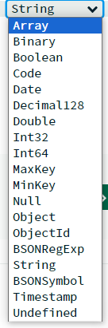

# 데이터베이스

### 데이터베이스란?

- 데이터베이스(Database: DB)란 일정한 규칙 또는 규약에 따라 구조화 되어 저장되어 있는 데이터의 모음입니다.

- 데이터베이스를 제어, 관리하는 통합 시스템을 DBMS(Database Management System)라고 하며, DB안의 데이터들은 특정 DBMS마다 정의 된 쿼리 언어를 통해 삽입, 삭제, 수정, 조회를 수행 할 수 있습니다.

- 실시간 접근과 동시 공유가 가능 합니다.

- EX: 응용 프로그램(node.js) <=> DBMS(MongoDB) <=> 데이터베이스(DB).

<br>

### 엔터티(Entity)

- 엔터티는 여러개의 속성을 지닌 명사를 말합니다. EX: 사람 Entity => 손, 발, 머리...

- 엔터티는 서비스의 요구 사항에 따라 속성이 정해집니다. 실제로 사람이 머리 없이 살수는 없지만, 서비스 요구사항에 머리가 필요 없을 때 머리 속성은 사라지게 됩니다.

- 엔터티는 약한 엔터티와 강한 엔터티로 나뉩니다. 약한 엔터티는 강한 엔터티에 존재 여부에 따라 종속적 입니다. 위의 사람이 강한 엔터티이고 손, 발 , 머리등은 약한 엔터티라고 할 수 있습니다.

<br>

### 릴레이션(Relation)

- 릴레이션은 데이터베이스에서 정보를 구분하여 저장하는 기본 단위를 말합니다. 

- 엔터티에 관한 데이터를 DB는 릴레이션 하나에 담아서 관리합니다.

- 릴레이션은 관계형 데이터베이스(MySQL등) 에서는 테이블이라고 하며 NoSQL 데이터베이스(MongoDB등) 에서는 컬렉션이라고 합니다.

<br>

#### 테이블 & 컬렉션

- 테이블과 컬렉션을 대표하는 각각의 DB인 MySQL과 MongoDB 의 경우

<br>

```

- MySQL: 레코드 - 테이블 - 데이터베이스 구조.

- MongoDB: 도큐먼트 - 컬렉션 - 데이터베이스 구조.

```

<br>

### 속성(Attribute)

- 속성은 릴레이션에서 관리하는 구체적이며 고유한 이름을 갖는 정보를 말합니다.

- 서비스의 요구사항을 기반으로 관리해야 할 필요성이 있는 속성들만 엔터티의 속성이 됩니다.

<br>

### 도메인(domain)

- 도메인이란 릴레이션에 포함된 각각의 속성들이 가질 수 있는 값의 집합을 말합니다.

- 사람 엔터티의 성별이라는 속성이 존재한다고 할 때, 이 속성이 가질 수 있는 값은 {남자, 여자}의 집합(도메인)이 됩니다.

<br>

### 필드 & 레코드(도큐먼트)

- 데이터베이스에서 필드와 레코드로 구성된 테이블을 작성할 수 있습니다.

- 사람 엔터티의 성별 속성이 바로 필드가 될 수 있습니다. 인종(황인, 흑인, 백인 등) 또한 필드 값이 될 수 있습니다.

- 테이블에 쌓이는 행(row) 단위의 데이터를 레코드라고 합니다 <=> 튜플이라고 하기도 함.

- 필드와 같은 경우 타입을 가집니다. 사람 엔터티의 이름, 성별, 인종, 전화번호 등의 속성이 있다고 가정합시다.

- MongoDB를 기준으로 설명할 때, 각 필드의 속성은 다음과 같이 정의 될 수 있습니다. 이름: String, 성별: Boolean(or String), 인종(String), 번호(Number)등



- 필드의 여러가지 타입을 지정하여 사용할 수 있습니다.

<br>

- 각 필드의 타입은 크게 숫자 타입, 날짜 타입, 문자 타입등으로 나뉩니다.

<br>

