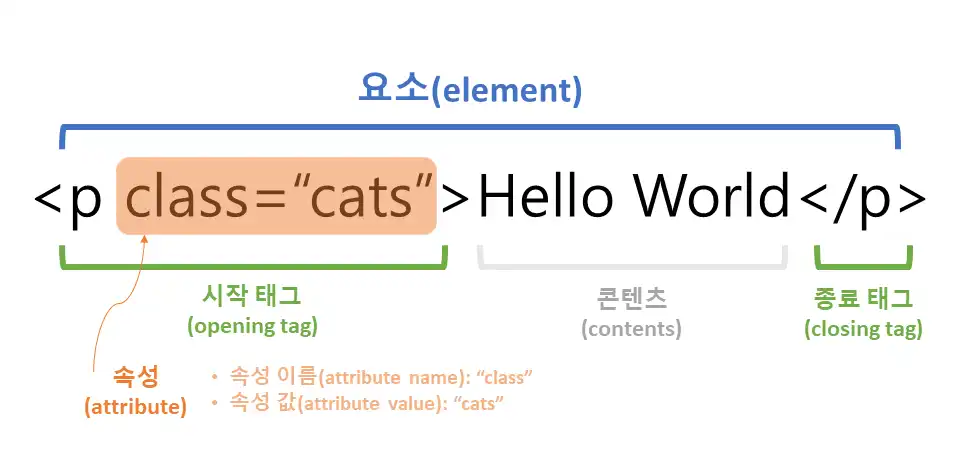

# HTML(Hyper Text Markup Language)

- HTML은 HyperText Markup Language의 약자로, 웹 페이지를 만들기 위해 사용되는 마크업 언어입니다. 

- 웹 페이지의 구조를 정의하고 내용을 표시하는데 사용됩니다. HTML은 웹 브라우저에게 문서의 구조와 의미를 전달하며, 사용자가 볼 수 있는 텍스트, 이미지, 링크, 폼 등을 구성합니다.

<br>

## 목차
  - [HTML 문서의 기본 구조](#html-문서의-기본-구조)
  - [HTML5에서 추가된 주요 기능](#html5에서-추가된-주요-기능)
  - [&lt;!DOCTYPE&gt; 의 역할?](#doctype-의-역할)
  - [HTML의 요소(Elements) & 태그(Tags)](#html의-요소elements--태그tags)
  - [블록(Block)요소 & 인라인(Inline)요소](#블록block요소--인라인inline요소)
  - [시맨틱(semantic) HTML](#시맨틱semantic-html)
  - [폼(form)](#폼form)
  - [HTML5 인풋 유형(Input Types)](#html5-인풋-유형input-types)
  - [테이블(Table)](#테이블table)
  - [테이블의 병합 방법](#테이블의-병합-방법)
  - [HTML 메타데이터(meta)](#html-메타데이터meta)
  - [크로스 브라우징(Cross Browsing)](#크로스-브라우징cross-browsing)
  - [HTML 문서의 유효성 검사](#html-문서의-유효성-검사)
  - [웹 접근성(Web Accessibility)](#웹-접근성web-accessibility)
  - [HTML의 마이크로데이터](#html의-마이크로데이터)

<br>

### HTML 문서의 기본 구조

```
<!DOCTYPE html>
<html lang="en">
<head>
    <meta charset="UTF-8">
    <meta name="viewport" content="width=device-width, initial-scale=1.0">
    <title>Document</title>
</head>
<body>
    <!-- content part -->
</body>
</html>
```

- 이 구조는 HTML5의 표준을 따르며, 다음과 같은 요소들로 구성됩니다.

1. `<!DOCTYPE html>`: HTML 문서의 형식을 나타내는 선언으로, 브라우저에게 이 문서가 HTML5로 작성되었음을 알려줍니다.

2. `<html>`: HTML 문서의 최상위 요소로서, 전체 문서의 컨텐츠를 감싸며 언어 속성을 포함할 수 있습니다.

3. `<head>`: 문서에 대한 메타데이터와 리소스(스타일시트, 스크립트 등)를 포함하는 부분입니다.

4. `<meta>`: 문서의 메타데이터를 정의하는데 사용됩니다. 예를 들어, 문자 인코딩과 뷰포트 설정 등을 포함할 수 있습니다.

5. `<title>`: 문서의 제목을 정의합니다.

6. `<body>`: 실제로 웹 페이지에 표시되는 내용을 포함하는 부분입니다. 텍스트, 이미지, 링크, 폼 등의 요소들이 이 부분에 들어갑니다.

<br>

### HTML5에서 추가된 주요 기능

- HTML5는 웹 개발자들에게 다양한 새로운 기능과 개선된 기능을 제공합니다. 주요 기능 중 일부는 다음과 같습니다.

1. 시맨틱 요소(Semantic Elements): HTML5에서는 시맨틱 요소들이 추가되어 문서의 의미와 구조를 더 명확하게 정의할 수 있습니다. 예를 들어,`<header>`, `<footer>`, `<nav>`, `<article>`, `<section>` 등의 요소가 도입되었습니다.

2. 비디오 및 오디오 지원: HTML5에서는 `<video>`와 `<audio>` 요소를 사용하여 비디오와 오디오를 웹 페이지에 쉽게 삽입할 수 있습니다. 이전에는 플래시 플러그인이 필요했던 영상 및 음악 재생 기능이 브라우저 자체에서 지원됩니다.

3. Canvas 그래픽: HTML5 Canvas 요소는 JavaScript를 사용하여 동적 그래픽 및 애니메이션을 생성할 수 있는 영역을 제공합니다. 이를 통해 게임, 시뮬레이션, 데이터 시각화 등의 다양한 그래픽 기능을 구현할 수 있습니다.

4. 웹 저장소(Web Storage): HTML5에서는 로컬 스토리지(localStorage)와 세션 스토리지(sessionStorage)라는 두 가지 웹 저장소 메커니즘이 추가되었습니다. 이를 통해 클라이언트 측에서 데이터를 로컬에 저장하고 영구적으로 사용할 수 있습니다.

5. 웹 SQL 데이터베이스(Web SQL Database): HTML5에서는 클라이언트 측에서 관계형 데이터베이스에 접근할 수 있는 Web SQL Database API가 도입되었습니다. 이를 통해 JavaScript를 사용하여 데이터를 로컬에 저장하고 관리할 수 있습니다.

6. 지리적 위치 정보(Geolocation): HTML5에서는 사용자의 지리적 위치를 결정하는 Geolocation API가 도입되었습니다. 이를 통해 브라우저를 통해 사용자의 위치를 추적하고 이를 기반으로 위치 기반 서비스를 제공할 수 있습니다.

7. 웹 소켓(WebSockets): HTML5에서는 웹 소켓을 지원하여 클라이언트와 서버 간의 양방향 통신을 가능하게 합니다. 이를 통해 실시간 데이터 전송 및 채팅 애플리케이션 등을 구현할 수 있습니다.

8. 드래그 앤 드롭(Drag and Drop): HTML5에서는 드래그 앤 드롭 API가 도입되어 사용자가 웹 페이지에서 요소를 드래그하여 다른 위치로 이동하거나 드롭할 수 있습니다.

- 외에도 HTML5는 폼 요소의 개선, 웹 폰트 지원, 캔버스 그래픽, 오프라인 웹 애플리케이션, 웹 워커(Web Workers) 등 다양한 기능과 API를 제공하여 웹 애플리케이션의 품질과 성능을 향상 시켰습니다.

<br>

### <!DOCTYPE> 의 역할?

- <!DOCTYPE>은 HTML 문서가 어떤 버전의 HTML이며 어떤 형식을 따르는지를 웹 브라우저에게 알려주는 역할을 합니다. 이 선언은 HTML 문서의 첫 줄에 위치하며, 다음과 같은 형태를 가집니다

- `<!DOCTYPE html>` 여기서 html은 HTML5를 가리키며, 이 문서가 HTML5로 작성되었음을 의미합니다. 이 선언은 웹 브라우저에게 문서를 어떻게 해석해야 하는지를 알려주어 올바른 렌더링을 보장합니다.

- 이전 버전의 HTML에서는 더 복잡한 형태의 DOCTYPE 선언이 필요했지만, HTML5에서는 간단하게 `<!DOCTYPE html>`만으로 문서의 버전을 명시할 수 있습니다. 이렇게 단순화된 DOCTYPE 선언은 HTML 문서를 작성하는 과정을 간편하게 만들어주었습니다.

<br>

### HTML의 요소(Elements) & 태크(Tags)

- HTML은 일련의 요소(Elements)와 태그(Tags)로 이루어져 있습니다. 각 요소는 화면에 표시되는 콘텐츠의 구조를 나타내며, 각 태그는 요소의 시작과 끝을 표시합니다.



1. HTML 요소(Element)

- HTML 요소는 문서의 구조를 나타내는 데 사용되는 부분입니다. 요소는 시작 태그, 종료 태그, 그리고 그 사이에 있는 콘텐츠로 구성됩니다.

- 예를 들어, `<p>` 태그는 단락 요소를 나타내며, `<div>` 태그는 구역을 나타냅니다. HTML 요소는 종종 여러 요소들을 포함할 수 있고, 서로 중첩될 수 있습니다.

2. HTML 태그(Tag)

- HTML 태그는 요소를 정의하기 위해 사용되는 특수한 문자열입니다. 태그는 각 요소의 시작과 끝을 나타내는데, 시작 태그는 `<tag>` 형식으로 작성되며, 종료 태그는 `</tag>` 형식으로 작성됩니다.

- 예를 들어, `<p>`는 단락 요소의 시작을 나타내는 시작 태그이고, `</p>`는 단락 요소의 종료를 나타내는 종료 태그입니다.

<br>

- 즉, HTML 요소는 문서의 구조를 나타내고, 태그는 요소를 정의하는 데 사용되는 특수한 문자열입니다. 요소와 태그는 HTML 문서를 만드는 데 있어서 기본적인 구성 요소입니다.

<br>

### 블록(Block)요소 & 인라인(Inline)요소

- 블록(Block) 요소와 인라인(Inline) 요소는 HTML 요소의 렌더링 방식을 설명하는 데 사용됩니다.

1. 렌더링 방식

- 블록(Block) 요소: 블록 요소는 항상 새로운 줄에서 시작하며, 사용 가능한 가로 공간을 모두 차지합니다. 즉, 화면의 가로폭 전체를 차지하고 다음 요소는 새로운 줄에서 시작합니다. 따라서 블록 요소는 수직으로 쌓이는 형태로 렌더링됩니다.

- 인라인(Inline) 요소: 인라인 요소는 새로운 줄에서 시작하지 않고, 요소가 나타나는 곳에서 텍스트의 일부로 처리됩니다. 인라인 요소는 요소의 너비와 높이가 내용에 따라 동적으로 결정되며, 다른 인라인 요소와 함께 한 줄에 표시될 수 있습니다.

2. 특징

- 블록(Block) 요소: 마크업을 할때 줄바꿈이 일어나 세로(수직 정렬)로 정렬이 되고 텍스트(문자)와 인라인 요소를 자식 요소로 포함할 수 있습니다. 블록 레벨 요소를 자식 요소로 포함 할 수 있는 요소와 포함할 수 없는 요소가 있으며, 또한 블록 요소는 너비나 값을 줄 수 있습니다.(width,height)

- 블록 레벨 요소 태크 예시: `<div>` , `<h1 ~ h6>`, `<ul>`, `<li>`

- 인라인(Inline) 요소: 마크업을 할 때 줄 바꿈이 일어나지 않아 가로(수평 정렬)로 정렬이 되고 텍스트(문자)와 인리인 요소를 자식 요소로 포함 할수 있습니다. 인라인 요소는 블록 레벨 요소를 자식 요소로 포함할 수 없고, 너비나 높이 값을 줄 수 없습니다.(width,height)

- 블록 레벨 요소 태크 예시: `<a>` , `<audio>`, `<span>`, `<input>`

<br>

### 시맨틱(semantic) HTML

- 시맨틱(semantic) HTML은 HTML 요소를 사용하여 문서의 구조와 의미를 명확하게 전달하는 것을 의미합니다. 즉, HTML 요소를 그들의 의미나 목적에 따라 사용하여 웹 페이지의 의도와 의미를 표현하는 것을 말합니다. 

- 예를 들어, `<header>`, `<footer>`, `<nav>`, `<section>` 등의 시맨틱 요소를 사용하여 웹 페이지의 구조를 명확하게 정의할 수 있습니다.

- 시맨틱 태그의 중요성

1. 검색 엔진 최적화(SEO): 검색 엔진은 시맨틱 HTML을 통해 문서의 구조와 내용을 이해하고 색인화합니다. 시맨틱 HTML을 사용하면 검색 엔진이 웹 페이지의 콘텐츠를 더 잘 파악할 수 있으며, 이는 검색 결과에 노출되는 페이지의 순위와 관련이 있습니다.

2. 웹 접근성(Web Accessibility): 시맨틱 HTML은 장애를 가진 사용자들이 웹 페이지에 쉽게 접근할 수 있도록 도와줍니다. 스크린 리더나 다른 보조 기술을 사용하는 사용자들은 시맨틱 HTML을 통해 페이지의 구조를 이해하고 콘텐츠에 더 쉽게 접근할 수 있습니다.

3. 코드의 가독성과 유지보수성: 시맨틱 HTML은 코드를 더 읽기 쉽고 이해하기 쉽게 만들어줍니다. 각 요소의 역할이 명확하게 정의되어 있기 때문에 다른 개발자들이나 나중에 자신이 작성한 코드를 쉽게 이해하고 수정할 수 있습니다.

4. 의미 있는 구조 전달: 시맨틱 HTML을 사용하면 문서의 구조와 콘텐츠의 의미를 명확하게 전달할 수 있습니다. 이는 사용자들이 웹 페이지를 더 잘 이해하고, 해당 페이지에 대한 정보를 더 빠르게 찾을 수 있도록 도와줍니다.

<br>

- 시맨틱 HTML을 사용하면 검색 엔진 최적화, 웹 접근성, 코드의 가독성 및 유지보수성 등 다양한 이점을 얻을 수 있으며, 이는 웹 페이지의 품질과 사용자 경험을 향상시키는 데 도움이 됩니다.

<br>

### 폼(form)

- `<form>` 요소는 웹 페이지에서 사용자로부터 정보를 입력 받기 위한 폼(Form)을 정의하는 데 사용됩니다. 

- 폼은 웹 사이트나 애플리케이션에서 사용자가 텍스트를 입력하거나 선택하고 해당 정보를 서버로 전송하는 데 사용됩니다. `<form>` 요소는 다음과 같은 역할을 합니다.

1. 사용자 입력 수집: 폼은 사용자로부터 텍스트 입력, 체크박스, 라디오 버튼, 드롭다운 메뉴 등과 같은 다양한 형식의 정보를 입력 받을 수 있습니다.

2. 데이터 전송: 사용자가 폼에 입력한 정보를 서버로 전송하는 역할을 합니다. 이를 위해 `<form>` 요소는 사용자가 제출(submit) 버튼을 클릭하면 입력된 데이터를 지정된 서버로 보내는 동작을 수행합니다.

3. 액션 지정: `<form>` 요소의 action 속성을 사용하여 폼이 제출될 때 데이터를 전송할 서버 측 스크립트 파일이나 URL을 지정할 수 있습니다.

4. 메서드 지정: `<form>` 요소의 method 속성을 사용하여 데이터를 전송하는 HTTP 메서드를 지정할 수 있습니다. 주로 GET 또는 POST 메서드가 사용됩니다.

5. 유효성 검사: HTML5에서는 `<form>` 요소에 내장된 유효성 검사 기능을 사용하여 클라이언트 측에서 사용자 입력을 유효성 검사할 수 있습니다. 이를 통해 사용자가 제출하기 전에 유효한 데이터만을 전송할 수 있습니다.

<br>

### HTML5 인풋 유형(Input Types)

- HTML5에서 도입된 폼 입력 유형 중 일부는 다음과 같습니다. 

1. `<input type="email">`: 사용자에게 이메일 주소를 입력할 수 있는 입력 필드를 제공합니다. 이 입력 필드는 이메일 형식이 아닌 값을 입력하면 브라우저에서 경고를 표시합니다.

2. `<input type="url">`: 사용자에게 URL을 입력할 수 있는 입력 필드를 제공합니다. 이 입력 필드는 유효한 URL 형식이 아닌 값을 입력하면 브라우저에서 경고를 표시합니다.

3. `<input type="tel">`: 사용자에게 전화번호를 입력할 수 있는 입력 필드를 제공합니다. 이 입력 필드는 전화번호 형식이 아닌 값을 입력하면 브라우저에서 경고를 표시합니다.

4. `<input type="date">`, `<input type="time">`, `<input type="datetime-local">`: 각각 날짜, 시간, 날짜와 시간을 선택할 수 있는 입력 필드를 제공합니다.

5. `<input type="number">`, `<input type="range">`: 숫자 값을 입력할 수 있는 입력 필드를 제공합니다. `<input type="number">`는 숫자 값을 직접 입력하고, `<input type="range">`는 범위를 조절할 수 있는 슬라이더를 제공합니다.

6. `<input type="file">`: 사용자에게 파일을 업로드할 수 있는 입력 필드를 제공합니다. 이를 통해 사용자는 컴퓨터에서 파일을 선택하고 서버로 업로드할 수 있습니다.

- 이러한 폼 입력 유형을 사용하여 사용자에게 더 직관적이고 편리한 입력 경험을 제공할 수 있습니다.

<br>

### 테이블(Table)

- HTML에서 표를 만들기 위해 사용되는 주요 요소 입니다. 데이터를 구조화하고 시각적으로 표시하기 위해 사용됩니다.

1. `<table>`: 표를 정의하는 데 사용됩니다. 이 요소는 전체 표를 감싸는 컨테이너 역할을 합니다.

2. `<tr>`: 표의 행을 정의하는 데 사용됩니다. 이 요소는 각각의 표 형식 데이터 행을 나타냅니다.

3. `<th>`: 표의 헤더 셀을 정의하는 데 사용됩니다. 헤더 셀은 표의 각 열의 제목을 나타냅니다.

4. `<td>`: 표의 데이터 셀을 정의하는 데 사용됩니다. 데이터 셀은 실제 데이터 값을 나타냅니다.

위의 요소들을 조합하여 원하는 형태의 표를 만들 수 있습니다. `<table>` 요소 안에 `<tr>` 요소들을 포함하여 각 행을 정의하고, 각 행 안에는 `<th>`나 `<td>` 요소들을 포함하여 셀을 정의합니다. `<th>` 요소는 헤더 셀을 나타내고, `<td>` 요소는 데이터 셀을 나타냅니다.

```
<table border="1">
    <tr>
        <th>이름</th>
        <th>나이</th>
        <th>성별</th>
    </tr>
    <tr>
        <td>John</td>
        <td>30</td>
        <td>남성</td>
    </tr>
    <tr>
        <td>Jane</td>
        <td>25</td>
        <td>여성</td>
    </tr>
</table>
```

<table border="1">
    <tr>
        <th>이름</th>
        <th>나이</th>
        <th>성별</th>
    </tr>
    <tr>
        <td>John</td>
        <td>30</td>
        <td>남성</td>
    </tr>
    <tr>
        <td>Jane</td>
        <td>25</td>
        <td>여성</td>
    </tr>
</table>

<br>

#### 테이블의 병합 방법

- HTML에서 표의 셀을 병합하는 방법은 `<th>` 및 `<td>` 요소에 colspan 및 rowspan 속성을 사용하는 것입니다. 이러한 속성을 사용하면 여러 개의 셀을 하나로 합치거나 셀을 여러 행 또는 열에 걸쳐 병합할 수 있습니다.

- colspan 속성: colspan 속성은 현재 셀을 포함하여 오른쪽으로 병합할 셀의 수를 지정합니다. 이는 수평 방향으로 셀을 병합하는 데 사용됩니다.

```
<tr>
    <td colspan="2">두 개의 셀 병합</td>
</tr>
```

- rowspan 속성: rowspan 속성은 현재 셀을 포함하여 아래로 병합할 셀의 수를 지정합니다. 이는 수직 방향으로 셀을 병합하는 데 사용됩니다.

```
<tr>
    <td rowspan="2">두 개의 셀 병합</td>
    <td>다른 셀</td>
</tr>
<tr>
    <td>다른 셀</td>
</tr>
```

<br>

### HTML 메타데이터(meta)

- `<meta>` 태그는 HTML 문서의 메타데이터를 정의하는 데 사용됩니다. 메타데이터는 문서 자체에 대한 정보나 문서가 브라우저에 표시되는 방식을 제어하는 정보 등을 포함합니다. `<meta>` 태그는 빈 요소(empty element)로서 시작 태그만 존재하며, 종료 태그가 없습니다.

- 주요 `<meta>` 태그의 속성과 역할입니다.

1. charset: 문서의 문자 인코딩을 지정합니다. 일반적으로 UTF-8 문자 인코딩을 사용하며, `<meta charset="UTF-8">`와 같이 사용됩니다.

2. name: 메타데이터의 이름을 지정합니다. 이 속성은 content 속성과 함께 사용되어 특정한 종류의 메타데이터를 정의합니다. 예를 들어 name="description"은 문서의 요약이나 설명을 정의하며, name="keywords"는 문서의 키워드를 정의합니다.

3. content: 메타데이터의 내용을 지정합니다. name 속성과 함께 사용되어 해당 메타데이터의 내용을 정의합니다. 예를 들어 content="This is a description of the page"은 페이지의 요약이나 설명을 정의합니다.

4. http-equiv: HTTP 헤더와 유사한 동작을 수행하는 몇 가지 특별한 메타데이터를 정의합니다. 이 속성은 웹 브라우저에게 특정한 명령을 제공합니다. 주로 캐시 제어, 페이지 리디렉션, 문서 새로고침 등의 목적으로 사용됩니다.

5. viewport: 모바일 기기에서 페이지의 뷰포트 설정을 지정합니다. 이를 통해 페이지의 스케일링과 레이아웃을 조절하여 모바일 환경에서 더욱 최적화된 경험을 제공할 수 있습니다.

<br>

- `<meta>` 태그는 일반적으로 다음과 같은 목적으로 사용됩니다

- 문서의 문자 인코딩 지정

- 검색 엔진 최적화를 위한 페이지 설명(description) 및 키워드(keywords) 설정

- 문서의 저작권 정보 지정

- 모바일 환경에서 뷰포트 설정

- 캐시 제어와 관련된 지시사항 제공

- HTTP 헤더와 유사한 동작을 수행하는 몇 가지 특별한 명령 제공

- `<meta>` 태그를 사용하여 웹 페이지를 보다 명확하게 설명하고 검색 엔진 및 브라우저에게 필요한 정보를 제공할 수 있습니다.

<br>

### 크로스 브라우징(Cross Browsing)

- 크로스 브라우징(Cross Browsing)이란 다양한 웹 브라우저에서 동일한 웹 페이지가 일관되게 표시되는 것을 의미합니다. 

- 다양한 웹 브라우저와 버전, 그리고 다양한 기기와 화면 크기에서 일관된 사용자 경험을 제공하는 것이 중요합니다. 이를 위해 다음과 같은 기술적인 접근 방식들이 있습니다.

1. 표준 준수(Standards Compliance): HTML과 CSS의 최신 표준을 준수하여 웹 페이지를 작성하는 것이 중요합니다. 표준 준수를 통해 웹 페이지가 여러 브라우저에서 더욱 일관된 방식으로 해석되도록 보장할 수 있습니다.

2. 프로그레시브 강화(Progressive Enhancement): 기본적인 HTML 구조와 콘텐츠는 모든 브라우저에서 잘 표시될 수 있도록 작성하고, 이후 CSS 스타일 및 JavaScript 기능을 추가하는 방식으로 웹 페이지를 개발합니다. 이러한 접근 방식은 모든 사용자에게 접근 가능한 웹 경험을 제공합니다.

3. 브라우저 테스트(Browser Testing): 다양한 브라우저와 버전에서 웹 페이지를 테스트하여 크로스 브라우징 문제를 식별하고 해결합니다. 이를 통해 각 브라우저에서 웹 페이지가 올바르게 렌더링되고 동작하는지 확인할 수 있습니다.

4. CSS 재정의(CSS Resets): 브라우저 간의 기본 스타일 차이를 줄이기 위해 CSS 리셋 파일을 사용하여 기본 스타일을 재정의할 수 있습니다. 이를 통해 브라우저 간의 일관된 스타일을 보장할 수 있습니다.

5. 플랫폼 호환성(Platform Compatibility): 다양한 기기와 운영 체제에서 웹 페이지가 일관되게 동작하도록 보장합니다. 모바일 디바이스, 태블릿, 데스크톱 등 다양한 플랫폼에서 웹 페이지가 올바르게 표시되고 상호 작용할 수 있어야 합니다.

- 이러한 기술적인 접근 방식들을 적용하여 웹 호환성을 향상시키고 크로스 브라우징 문제를 해결할 수 있습니다. 이를 통해 모든 사용자가 일관된 사용자 경험을 얻을 수 있습니다.

<br>

### HTML 문서의 유효성 검사

- HTML 문서의 유효성은 HTML 문법 규칙을 준수하고 웹 표준에 맞게 작성되었는지를 나타냅니다. HTML 문서가 W3C(세계 웹 컨소시엄)에서 정의한 HTML 규격에 부합하는지를 확인하는 것입니다. 유효성 검사를 통해 다음과 같은 사항을 확인 가능합니다.

1. 구문 오류(Syntax Errors): HTML 문서가 정확한 구문으로 작성되었는지 확인합니다. 예를 들어, 시작 태그와 종료 태그의 대응 여부, 속성 값의 따옴표 사용 여부 등을 검사합니다.

2. 웹 표준 준수(Standards Compliance): HTML 문서가 W3C에서 정의한 HTML 표준을 준수하는지 확인합니다. 이는 브라우저 간의 호환성과 일관된 동작을 보장하는 데 중요합니다.

3. 접근성(Accessibility): 유효성 검사를 통해 웹 페이지가 웹 접근성 지침을 준수하는지 확인할 수 있습니다. 이는 모든 사용자, 특히 장애를 가진 사용자들이 웹 페이지를 이해하고 상호 작용할 수 있도록 보장하는 데 도움이 됩니다.

4. 성능 및 SEO(Search Engine Optimization): 유효한 HTML 문서는 검색 엔진에 더 잘 색인되고 검색 결과에서 더 높은 순위를 차지할 수 있습니다. 또한 유효한 HTML은 브라우저에서 더 빠르게 렌더링되어 성능을 향상시킵니다.

<br>

- HTML 문서의 유효성을 검사하는 방법에는 여러 가지가 있습니다. 대표적인 방법과 함께 유효성 검사에 사용되는 도구들 입니다.

1. W3C Markup Validation Service: W3C(세계 웹 컨소시엄)가 제공하는 마크업 유효성 검사 서비스로, HTML 문서의 구조적인 유효성을 검사합니다. 사용자가 직접 HTML 코드를 입력하거나 웹 페이지의 URL을 제출하여 검사할 수 있습니다.

2. HTML5 Outliner: HTML5 문서의 구조를 시각적으로 분석하여 문서의 구조를 살펴볼 수 있는 도구입니다. HTML5 문서에서 사용된 제목 요소와 구획 요소를 파악하여 문서의 구조를 확인할 수 있습니다.

3. Browser Developer Tools: 대부분의 웹 브라우저는 개발자 도구를 제공하며, 이를 통해 HTML 문서를 검사할 수 있습니다. 개발자 도구를 사용하여 문서의 요소 구조, 속성, 스타일 등을 확인하고 문제를 식별할 수 있습니다.

4. Linting Tools: HTML 문서의 코드 스타일, 문법 오류 및 일반적인 문제를 식별하기 위해 린팅 도구를 사용할 수 있습니다. 예를 들어, ESLint나 JSHint와 같은 도구는 JavaScript 코드를 검사할 뿐 아니라 HTML에도 적용할 수 있는 확장이 있습니다.

5. IDE(Integrated Development Environment): 많은 개발 환경은 HTML 문서의 유효성을 검사할 수 있는 내장된 도구나 플러그인을 제공합니다. 예를 들어, Visual Studio Code는 HTML 문서의 구문 오류를 식별하고 표시하는 기능을 제공합니다.

- 이러한 도구들을 사용하여 HTML 문서의 유효성을 검사하면 문서의 구조적인 오류나 문제를 식별하고 수정할 수 있습니다. 이는 웹 페이지의 호환성과 성능을 향상시키는 데 도움이 됩니다.

<br>

### 웹 접근성(Web Accessibility)

- 웹 접근성(Web Accessibility): 웹 접근성은 모든 사용자, 특히 장애를 가진 사용자들이 웹 콘텐츠에 동등하게 접근할 수 있도록 하는 것을 목표로 합니다. 

- 이는 시각 장애, 청각 장애, 운동 장애, 인지적 장애 등의 장애를 가진 사용자들이 웹 페이지를 이해하고 상호 작용할 수 있도록 보장하는 것을 의미합니다.

- 웹 접근성을 향상시키기 위해 사용되는 HTML 요소나 속성은 다양하며 특정 장애를 가진 사용자들이 더 쉽게 이해하고 사용할 수 있도록 도와줍니다. 여기에는 몇 가지 주요 요소와 속성이 있습니다.

<br>

1. `<nav>`: `<nav>` 요소는 네비게이션 링크를 정의하는 데 사용됩니다. 이를 사용하여 사용자가 웹 사이트의 메뉴나 내비게이션 구조를 쉽게 식별할 수 있습니다.

2. `<header>`: `<header>` 요소는 웹 페이지의 머릿말을 정의하는 데 사용됩니다. 이를 통해 페이지의 제목, 로고, 검색 폼 등 중요한 콘텐츠를 제공하여 사용자가 웹 페이지의 구조를 이해하는 데 도움이 됩니다.

3. `<footer>`: `<footer>` 요소는 웹 페이지의 푸터를 정의하는 데 사용됩니다. 이를 통해 저작권 정보, 연락처 정보, 사이트 링크 등을 제공하여 사용자가 페이지를 마치고 추가 정보를 얻을 수 있습니다.

4. `<main>`: `<main>` 요소는 웹 페이지의 주요 콘텐츠를 정의하는 데 사용됩니다. 이를 사용하여 페이지의 핵심 콘텐츠를 명시적으로 정의하고 스크린 리더 사용자에게 주요 콘텐츠에 직접적으로 액세스할 수 있는 지점을 제공할 수 있습니다.

5. aria-label 및 aria-labelledby 속성: 이러한 속성은 의미론적으로 의미가 없는 요소에 레이블을 제공하는 데 사용됩니다. 이를 통해 스크린 리더 사용자에게 요소의 의미를 전달할 수 있습니다.

6. alt 속성: `` 요소의 alt 속성은 이미지의 대체 텍스트를 제공하는 데 사용됩니다. 이를 통해 시각적 장애를 가진 사용자나 이미지가 로드되지 않은 경우에도 이미지의 내용을 이해할 수 있습니다.

7. tabindex 속성: tabindex 속성은 키보드 탐색 순서를 정의하는 데 사용됩니다. 이를 사용하여 사용자가 키보드로 웹 페이지를 탐색할 때 포커스가 이동하는 순서를 제어할 수 있습니다.

<br>

- 이러한 요소와 속성은 웹 페이지의 구조를 더 명확하게 만들고, 이를 통해 모든 사용자가 웹 콘텐츠에 동등하게 접근할 수 있도록 하는 데 기여합니다.

<br>

### HTML의 마이크로데이터

- HTML 마이크로데이터는 웹 페이지에 추가된 작은 데이터 조각으로, 데이터를 구조화하여 검색 엔진이 이해하고 처리할 수 있도록 돕습니다. 이는 웹 페이지의 콘텐츠를 더 의미있게 설명하고 검색 결과에 더 많은 정보를 표시할 수 있도록 합니다.

- 마이크로데이터는 일반적으로 `<span>`, `<div>`, `<p>` 등의 HTML 요소에 추가되며, 데이터 유형(Data Type)과 속성(Property)을 지정하여 해당 데이터가 무엇을 의미하는지 설명합니다. 주로 Schema.org에서 정의한 마이크로데이터 유형을 사용합니다.

```

//제품 정보를 포함하는 마이크로데이터의 예시

<div itemscope itemtype="http://schema.org/Product">
  <h1 itemprop="name">상품명</h1>
  <p itemprop="description">상품 설명</p>
  <span itemprop="brand">브랜드명</span>
  <span itemprop="price">가격</span>
</div>

```

- 마이크로데이터를 추가하면 검색 엔진은 해당 데이터를 더 잘 이해하고 검색 결과 페이지에 추가 정보를 제공할 수 있습니다. 예를 들어, 제품 검색 결과에는 제품명, 설명, 브랜드, 가격 등이 포함될 수 있습니다.

- 마이크로데이터는 SEO에도 긍정적인 영향을 미칠 수 있습니다. 검색 엔진은 마이크로데이터를 사용하여 검색 결과를 풍부하게 표시하고, 사용자에게 더 많은 정보를 제공할 수 있습니다. 

- 이로 인해 검색 결과의 표시가 더욱 강조되며, 사용자들은 더욱 유용한 정보를 빠르게 찾을 수 있습니다. 따라서 마이크로데이터를 사용하여 웹 페이지의 콘텐츠를 구조화하고 SEO에 유리한 검색 결과를 얻을 수 있습니다.

<br>