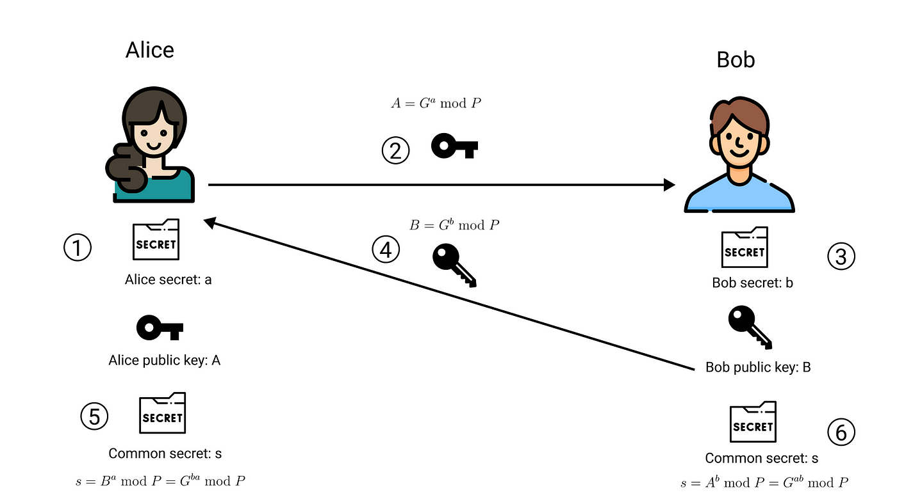

# HTTP

- HTTP는 전송 계층 위에 있는 애플리케이션 계층으로 웹 서비스의 통신에서 사용 됩니다. 1.0 부터 3까지 발전을 하였으며 하나씩 알아보겠습니다.

<br>

### HTTP/1.0

- 기본적으로 한 연결 당 하나의 요청을 처리하도록 설계 되었습니다. 

- 이 떄문에 RTT가 증가 하게 되었습니다.

  - RTT: 패킷이 목적지에 도달한 후 다시 출발지로 돌아오는데에 걸리는 패킷 왕복 시간을 말합니다.

- 서버로부터 파일을 가져올 때 TCP의 3way-handshake 를 계속해서 열어야 하기 때문에 RTT가 증가 하였습니다.

<br>

### RTT 해결 방법

- 서버에 부담이 많이가고 사용자 응답 시간이 길어졌기 떄문에 이미지 스플리팅, 코드 압축, 이미지 Base64 인코딩을 하는 방법을 사용하였습니다.

<br>

```

- 이미지 스플리팅: 다수의 이미지는 과부하가 걸리기 때문에 많은 이미지가 합쳐진 하나의 이미지를 다운, Image의 position을 이용하여 표기합니다.
  
- 코드 압축: 코드를 압축하여 빈 칸, 개행 문자등을 없애 크기를 최소화 합니다. 
  
- 이미지 Base64 인코딩: 64 진법으로 이루어진 문자열로 이미지를 코딩 합니다. 이미지에 대해 HTTP 요청을 할 필요가 없다는 장점이 있습니다. 하지만 크기가 37% 정도 커진다는 단점이 있습니다.

```

<br>

### HTTP/1.1

- 1.0에서 발전한 1.1 입니다. 매번 TCP 연결을 하는 것이 아닌 초기 TCP를 초기화 한 이후에 keep-alive 옵션을 사용하여, 여러개의 파일을 송수신 할 수 있도록 발전하였습니다. 기존 1.0에도 이 옵션은 존재하였으나 표준화가 되어있지 않았기 때문에 1.1 부터 기본 옵션이 되었습니다.

<br>


- 한번 TCP 3way-handshake가 발생하면 그 다음부터 발생하지 않습니다. 하지만 문서 안에 포함된 다수의 리소스(css, js, 이미지 등)를 처리 할 때 요청할 리소스 개수에 비례, 대기 시간이 길어지는 단점이 있습니다.

<br>

#### HOL Blocking

- HOL Blocking(Head Of Line Blocking)은 네트워크에서 같은 큐에 있는 패킷이 첫 번째 패킷에 의해 지연될 때 발생하는 현상을 말합니다.

- EX: 첫 패킷인 이미지 파일 다운이 늦어짐 => css , js 파일 모두 늦어짐.

- HTTP/1.1의 경우에는 헤더에 쿠키 등의 많은 meta data가 들어 있고 압축이 되어있지 않았기 때문에 무거웠습니다.

<br>

### HTTP/2

- HTTP/2 는 보다 지연 시간을 줄이고 응답 시간을 빠르게 하며 멀티플렉싱, 헤더 압축, 서버 푸시, 요청의 우선 순위 처리를 지원하는 프로토콜 입니다.

<br>

```

- 멀티 플렉싱: 여러개의 스트림(시간이 지나면서 사용할 수 있게 되는 데이터 요소를 가리키는 데이터 플로우 방식)을 사용하여 송수신 합니다. 특정 패킷이 손실 되어도 해당 스트림에만 영향을 끼치고 나머지는 정상 작동합니다.

- 헤더 압축: 허프만 코딩 압축 알고리즘(전체 데이터 표현에 필요한 비트의 수를 줄이는 원리)을 사용하는 HPACK 압축 형식을 거쳐 헤더를 압축합니다. 

- 서버 푸시: HTTP/2는 클라이언트의 요청 없이 서버가 바로 리소스를 푸시 합니다. html 파일에 css, js 파일이 포함되는데 html 을 읽으면서 안에 있는 css, js파일 또한 푸시 합니다.

```

<br>

### HTTPS

- HTTP/2 는 HTTPS 위에서 동작합니다. 애플리케이션 계층과 전송 계층 사이에 신뢰 계층인 SSL/TLS 계층을 넣어 신뢰 할 수 있는 HTTP 요청을 말합니다. (통신 암호화)

<br>

#### SSL/TLS

- SSL(Secure Socket Layer)은 1.0 ~ 3.0, TLS(Transport Layer Security Protocol) 1.0, TLS 1.3 까지 버전이 올라가며 마지막 명칭은 TLS 로 변경 되었으나, 보통  합쳐서 SSL/TLS 라고 합니다.

- SSL/TLS 는 전송 계층에서 보안을 제공하는 프로토콜 입니다. 클라이언트 <=> 서버 간의 통신 시 SSL/TLS 를 통해 제 3자가 메시지를 도청, 변조 하지 못하게 합니다(인터셉터). 

- 보안 세션을 기반으로 데이터를 암호화 하여 세션이 만들어질 때 인증 메커니즘, 키 교환 암호화 알고리즘, 해싱 알고리즘이 사용 됩니다.

- 보안 세션이란 보안이 시작되고 끝나는 동안 유지 되는 세션을 말하며, SSL/TLS 는 핸드셰이크를 통해 보안 세션을 생성, 이를 기반으로 상태 정보를 공유합니다.

- 여기서 세션이란 OS 가 어떠한 사용자로부터 자신의 자산 이용을 허락하는 일정한 기간을 말합니다. 즉 사용자는 세션이 유효한 동안 프로그램을 사용할 수 있습니다.

<br>

### 인증 메커니즘

- 인증 메커니즘은 CA(Certificate Authorities)에서 발급한 인증서를 기반으로 이루어 집니다. CA발급 인증서는 안전한 연결을 시작하기 위해 공개키를 클라이언트에 제공합니다.

- 사용자가 접속한 서버가 신뢰할 수 있는 서버임을 보장합니다.

- CA는 아무 기업이 할 수 있는 것은 아니고, 신뢰성이 공인된 기업만이 참여할 수 있습니다. 대포적으로 GoDaddy, 아마존 등의 기업이 있습니다.

- CA를 발급 받기 위해서 자신의 사이트 정보와 공개키를 CA에 제출해야 합니다. CA는 공개키를 해시한 값인 지문(finger Print)을 사용하는 CA의 비밀 키 등을 기반으로 인증서를 발급 합니다. 

<br>

### 암호화 알고리즘

- 키 교환 알고리즘으로는 ECDHE , DHE 를 사용합니다. 둘 다 디피-헬만(Diffie-Hellman) 방식을 근간으로 만들어졌습니다.



- 위 식에서 G, a, P 를 알 때 A를 구하기는 쉽지만 G, A, P만 알때는 a 를 구하기 어려운 원리를 기반으로 만들어진 알고리즘 입니다.

- 처음 공개 키를 공유하고, 각자의 비밀 키와 혼합 한후, 혼합된 키를 공유합니다. 다시 비밀 키와 혼합하면 공통 암호키인 PSK(Pre-Shared key)가 생성 됩니다.

### 해싱 알고리즘

- 해싱 알고리즘은 데이터를 추정하기 힘든 더 작고 섞여있는 조각으로 만드는 알고리즘 입니다. SSL/TLS는 해싱 알고리즘으로 SHA-256 알고리즘, SHA-384 알고리즘을 사용합니다.

<br>

#### SHA-256 알고리즘

- 해시 함수의 결과 값이 256 비트인 알고리즘이며 비트코인을 비롯 여러 블록체인 시스템에서 사용되는 중 입니다.

- 해싱을 해야하는 메시지에 특정문자를 추가하는 등 전처리를 통한 메시지를 기반으로 해시 값을 반환 합니다. 

<br>

```

- 해시: 다양한 길이를 가진 데이터를 고정된 길이를 가진 데이터로 매핑(mapping) 하는 것입니다.

- 해싱: 임의의 데이터를 해시로 바꿔주는 일이며 함수가 이를 담당 합니다.

- 해시 함수: 임의의 데이터를 입력 받아 일정한 길이의 데이터로 바꿔주는 함수.

```

- TLS1.3 에서 사용자가 이전에 방문한 사이트를 재방문 하였을 때 SSL/TLS 에서 보안 세션을 만들 때 걸리는 통신을 하지 않아도 되는데 이를 0-RTT 라고 합니다.

<br>

### SEO와 HTTPS의 관계

- 구글은 SSL 인증서를 강조 하였고 사이트 내 모든 요소가 동일 할 경우, HTTPS 서비스를 하는 사이트가 그렇지 않은 사이트보다 SEO 순위가 높을 것이라고 공시 발표 하였습니다.

- SEO(Search Engine Optimization)는 검색 엔진 최적화를 말합니다. 검색 결과를 상단에 노출 시키기 위해 최적화 하는 법을 말합니다.

- 이를 위한 방법으로 캐노니컬 설정, 메타 설정, 페이지 속도 개선, 사이트 맵 관리 등이 있습니다.

<br>

### HTTP/3

- HTTP/3 는 1.1 , 2 버전과 함께 www 에서 정보를 교환 하는데 사용되는 HTTP의 세번째 버전 입니다.

- TCP 위에서 돌아가는 HTTP/2와 달리 HTTP/3는 QUIC라는 계층 위에서 돌아가며 TCP 가 아닌 UDP 기반으로 돌아갑니다.

- HTTP/2 의 장점인 멀티플렉싱을 가지고 있으며, 초기 연결 설정 시 지연 시간 감소(TCP의 3way-handshake 과정을 안거치기 때문에)라는 장점이 있습니다.

- QUIC는 첫 연걸 설정에 1-RTT만 소요 되고, 클라이언트가 서버에 어떤 신호를 한 번 주고 서버도 거기에 응답하기만 하면 통신이 가능합니다.

- 오류 수정매커니즘(FEC: Forward Error Connection)이 적용되었습니다. 전송 패킷이 손실 되었을 떄 수신 측에서 에러를 검출, 수정 하여 열약한 네트워크 에서도 낮은 패킷 손상률을 보입니다.

