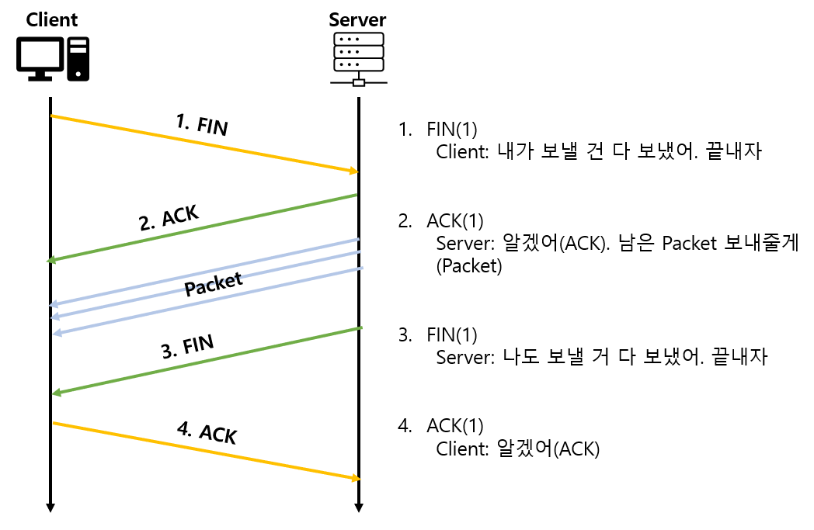

# TCP/IP

### TCP/IP 4계층 모델

- 인터넷에서 컴퓨터들이 서로의 정보를 주고받는데 사용되는 프로토콜의 집합입니다. TCP/IP 4계층 모델, OSI 7계층 모델로 설명할 수 있습니다.

- TCP/IP는 네트워크에서 사용되는 통신 프로토콜의 집합으로 프로토콜의 네트워킹 범위에 따라 4계층으로 구성 됩니다.

<ime src="../../Images/Network/tcpipEdit.png"/>

<br>

### 계층 구조

- 사진을 보면 알 수 있듯이, TCP/IP 계층과 달리 OSI 7계층은 애플리케이션 계층을 3개로, 링크 계층(Network Interface)을 데이터 링크, 물리 계층으로 나누어서 표현 합니다. 또 인터넷 계층을 네트워크 계층으로 부릅니다.

- 우선 애플리케이션 계층 부터 살펴 봅시다.

<br>

### 애플리케이션 계층

- 애플리케이션 계층은 FTP, HTTP, SSH, SMTP, DNS 등 운용 프로그램이 사용되는 프로토콜 계층 입니다. 

- 웹 서비스, 이메일 등 서비스를 제공 합니다.

```

1. FTP
- 노드끼리 파일을 전송 할 때 사용되는 표준 통신 규약

2. SSH
- 보안이 되지 않은 네트워크에서 서비스를 안전하게 운용하기 위한 암호화 네트워크 규약

3. HTTP
- WWW를 위한 통신 기초, 웹 사이트를 이용하는데 사용되는 규약

4. SMTP
- 전자 메일 전송을 위한 인터넷 표준 통신 규약

5. DNS
- 도메인 이름, IP 주소를 매핑 해주는 서버
```

<br>

### 전송 계층

- 전송(Transport) 계층은 송수신자를 연결하는 통신 서비스를 제공합니다. 

- 애플리케이션과 인터넷 계층 사이의 데이터가 전달 되는 중계 역할을 합니다. 대표적으로 TCP/UDP 가 있습니다.

<br>

### TCP

- 패킷 사이의 순서를 보장합니다. 연결지향 프로토콜을 사용해서 연결하며, 신뢰성을 구축해서 수신 여부를 확인하며 "가상회선 패킷 교환" 방식을 진행 합니다.

<br>

#### 가상회선 패킷 교환 방식?

- 각 패킷에 가상회선 식별자가 포함되며 모든 패킷을 전송하면 가상회선을 해제, 패킷들은 전송 된 순서대로 도착하는 방식을 말합니다.

<br>

### UDP

- 순서를 보장하지 않습니다. 수신 여부를 확인하지 않으며 데이터만 주는 "데이터그램 패킷 교환" 방식을 사용합니다.

#### 데이터그램 패킷 교환 방식?

- 패킷이 독립적으로 이동하며 최적의 경로를 선택하여 이동합니다. 하나의 메시지에서 분할된 여러 패킷은 서로 다른 경로로 전송 될 수 있으며, 도착한 순서가 다를 수 있습니다.

<br>

### TCP 3-way handshake

- TCP의 신뢰성 확보는 3-way handshake 작업을 통해 이루어집니다.


<ime src="../../Images/Network/3wayhandshake.png"/>

- 클라이언트와 서버가 통신시 다음과 같은 세 단계 과정을 거칩니다.

```

1. SYN(Synchronize) 단계

- 클라이언트는 서버에 연결을 요청하기 위해 SYN 패킷을 보냅니다.

- SYN 패킷에는 클라이언트가 선택한 초기 시퀀스 번호(ISN : Initial Sequence Number)가 포함됩니다.

- 이 시퀀스 번호는 클라이언트가 보내는 데이터 스트림의 시작점을 나타냅니다.

2. SYN-ACK (Synchronize-Acknowledgment) 단계

- 서버는 클라이언트의 요청을 받고, 연결을 수락하며 응답하기 위해 SYN-ACK 패킷을 보냅니다.

- 서버가 선택한 초기 시퀀스 번호와 함께, 클라이언트가 보낸 시퀀스 번호의 다음 값을 응답 패킷에 포함시킵니다.

- 이는 서버가 클라이언트로부터 데이터를 받을 준비가 되었다는 것을 의미합니다.

3. ACK (Acknowledgment) 단계

- 클라이언트는 서버의 응답을 받으면 ACK 패킷을 보냅니다.

- 이 패킷은 서버가 보낸 SYN-ACK 패킷을 수신하고 연결이 성공적으로 설정되었음을 확인하는 것입니다.

- 이제 클라이언트와 서버는 양방향 통신을 위한 안정적인 TCP 연결을 가지고 있습니다.

```

- 위 과정을 통해 신뢰성이 구축되고 데이터 전송을 시작합니다. TCP는 이 과정을 거치기에 신뢰성이 있는 계층이라고 하지만, UDP의 경우 이루어지지 않기 때문에 신뢰성이 없는 계층이라고 합니다.

<br>

### TCP 4-way handshake

- TCP의 연결 해제시 4-way handshake 과정이 이루어 집니다.



```
1. FIN (Finish) 단계

- 클라이언트는 먼저 연결을 종료하고자 할 때, 서버에게 FIN 패킷을 보냅니다.

- 클라이언트가 더 이상 데이터를 보내지 않을 것임을 서버에게 알리는 것입니다.

- 클라이언트: FIN_WAIT_1 상태.

2. ACK (Acknowledgment) 단계

- 서버는 클라이언트의 FIN 패킷을 수신하고 확인하기 위해 ACK 패킷을 보냅니다.

- 서버는 여전히 클라이언트로부터 데이터를 수신할 수 있기 때문에 연결을 닫지 않습니다.

- 서버: CLOSE_WAIT 상태 , 클라이언트가 ACK를 받은 후 서버: FIN_WAIT_2 상태.

3. FIN (Finish) 단계

- 이제 서버도 연결을 종료하고자 할 때, 클라이언트에게 FIN 패킷을 보냅니다.

- 이는 서버가 더 이상 데이터를 보내지 않을 것임을 클라이언트에게 알리는 것입니다.

4. ACK (Acknowledgment) 단계

- 클라이언트는 서버의 FIN 패킷을 수신하고 확인하기 위해 ACK 패킷을 보냅니다.

- 이후 클라이언트와 서버는 모두 연결을 종료하고 TCP 연결은 완전히 종료됩니다.

- 클라이언트 상태: TIME_WAIT 상태 , 서버가 ACK를 받은 후 : CLOSED 상태.

```

- 클라이언트가 바로 연결을 닫는 것이 아닌 TIME_WAIT 상태가 되는 이유는 지연 패킷이 발생하는 경우를 대비하기 위해서 입니다.

- 뒤늦게 도착한 패킷을 처리하지 못하였을 때 데이터 무결성 문제가 발생.

<br>

### 인터넷 계층 

- 인터넷 계층은 장치로 받은 패킷을 IP 주소로 지정된 목적지로 전송하기 위해 사용하는 계층 입니다.

- IP, ICMP 등이 있으먀 패킷을 수신해야 할 상대의 주소를 지정하여 데이터를 송신 합니다.

- 상대방이 제대로 수신하였는지에 대해 보장하지 않는 비연결형적 특징을 가집니다.

<br>

### 링크 계층

- 링크 계층은 전선, 광섬유, 무선 등 실질적으로 데이터를 직접 전달하며 장치 간 신호를 주고받는 "규칙"을 정하는 계층 입니다.

- OSI 7계층 에서 이를 물리, 데이터 링크 계층으로 나누기도 합니다. 
  - 물리(physic) 계층은 무선 LAN, 유선 LAN을 통해 0, 1 로 이루어진 데이터를 보내는 계층을 말합니다.
  - 데이터 링크 계층은 이더넷 프레임을 통해 에러확인, 흐름제어, 접근제어를 담당하는 계층 입니다.

<br>

#### 전 이중화 통신

- 전 이중화(full duplex) 통신은 양쪽 장치가 동시에 송수신 하는 방식을 말합니다.

- 송신로, 수신로로 나뉘어 데이터를 주고 받으며 현대 고속 이더넷이 이 방식으로 통신 합니다.

<br>

#### CSMA/CD

- 이전에는 유선 LAN에서 반 이중화 통신 중 하나인 CSMA/CD(Carrier Sense Multiple Access with Collision Detection) 방식을 사용 했습니다.

- 데이터를 보낸 이후 충돌이 발생한다면 일정 시간 이후 재전송 하는 방식을 말합니다(반이중화 통신).

- 송, 수신로를 각각 둔 것이 아니라 한 경로를 기반으로 데이터를 보내기 때문에 데이터 충돌에 대비하기 위한 전략 입니다.


<br>

### 유선 LAN 케이블

- 유선 LAN 케이블로는 TP(Twisted pair)케이블 또는 광섬유 케이블이 대표적 입니다.

<br>

#### TP 케이블

- TP 케이블은 하나 처럼 보이지만 실제로는 8개의 구리선을 두 개씩 꼬아서 묶은 케이블을 말합니다.

- 구리선을 실드 처리하지 않고 덮은 UTP 케이블, 실드 처리하고 덮은 STP 케이블로 나뉩니다. 흔히 볼 수 있는 것은 UTP 케이블로 LAN 케이블 이라고 합니다.

<br>

#### 광섬유 케이블

- 광섬유를 사용해서 만든 케이블 입니다. 레이저를 이용한 통신을 하기 때문에 구리선 보다 장거리 고속 통신이 가능합니다. 

- 유리 또는 플라스틱 섬유로 제작하여 들어간 빛이 내부에서 반사 되면서 전진하는 방식 입니다. 

- 빛의 굴절률이 높은 부분을 코어라고 하며 낮은 부분을 클래딩 이라고 합니다.

<br>

### 무선 LAN(IEEE802.11)

- 무선 LAN 장치는 송수신에 같은 채널을 사용하기 때문에 반이중화 통신을 사용 합니다.

<br>

#### 반이중화 통신

- 반이중화 통신(half duplex)은 양 장치가 서로 통신 가능하지만, 동시에는 불가능한 구조를 말합니다.

- 둘 이상의 장치가 동시 전송시 충돌이 발생하여 메시지가 손실되기 때문에 충동 방지 시스템이 필요합니다.

<br>

#### 무선(Wireless) LAN의 주파수?

- WLAN(Wireless Local Area Network) 무선 신호 전달 방식을 이용하여 2대 이상의 장치를 연결하는 방식을 말합니다.

- 비유도 매체인 공기에 주파수를 보내 무선 통신망을 구축, 주파수 대역은 2.4GHz, 5GHz 대역 중 하나를 써서 구축 합니다.

- 2.4 대역의 경우 장애물에 강한 특성을 가지고 있지만 전자레인지나 무선 등 전파 간섭이 일어나는 경우가 있기에 5 대역(사용 채널 수多, 동시 사용 가능)을 사용하는 것이 좋습니다.

<br>

#### WIFI

- 와이파이는 전자기기들이 무선 LAN 신호에 연결할 수 있게하는 기술 입니다. 이를 위해 무선 접속 장치(AP, Access Point)가 있어야 합니다.

- 흔히 말하는 공유기가 해당 되며, 이를 통해 유선 LAN에 흐르는 신호를 무선 LAN 신호로 바꾸어 신호가 닿는 범위 내에서 가용(블루투스도 해당) 가능합니다.
