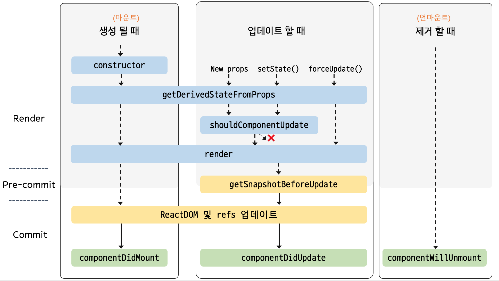

# 리액트(React)

- 페이스북에서 개발한 오픈소스 JavaScript 라이브러리인 React는 사용자 인터페이스(UI)를 만들기 위하여 사용되며, 웹 애플리케이션의 구성 요소를 만들고 관리하는 데에 도움이 됩니다.

<br>

### 리액트의 원리

1. 가상 DOM (Virtual DOM): React는 가상 DOM을 사용하여 UI를 효율적으로 업데이트합니다. 변경 사항은 먼저 가상 DOM에 반영되고, 이후에 실제 DOM에 반영됩니다. 이를 통해 성능이 향상되고 불필요한 DOM 조작을 최소화합니다.

2. 컴포넌트 기반 아키텍처: React는 UI를 독립적인 컴포넌트로 나누어 개발합니다. 각 컴포넌트는 자체적으로 상태를 관리하고 UI를 렌더링합니다. 이를 통해 재사용성이 높아지고 유지보수가 쉬워집니다.

3. 단방향 데이터 흐름: React는 단방향 데이터 흐름을 따릅니다. 부모 컴포넌트에서 자식 컴포넌트로 데이터가 전달되는 방식으로, 데이터의 흐름이 명확해지고 예측 가능성이 높아집니다.

<br>

### 리액트의 특징

1. JSX 문법: React는 JSX 문법을 사용하여 JavaScript 코드 안에 마크업을 작성할 수 있습니다. 이를 통해 UI를 선언적이고 간결하게 작성할 수 있습니다.

2. 단일 페이지 애플리케이션 (SPA) 지원: React는 SPA를 구축하는 데에 적합한 라이브러리입니다. 페이지 전환 시에도 페이지 전체를 다시 렌더링하지 않고 필요한 부분만 업데이트하여 사용자 경험을 향상시킵니다.

<br>

### 리액트의 장단점

- 장점: 가상 DOM을 통한 업데이트와 단방향 데이터 흐름을 통해 성능을 향상 시킬 수 있고, 컴포넌트 기반 아키텍처를 통해 코드의 재사용성이 높아지고 유지보수가 쉬워집니다.

- 단점: SEO (검색 엔진 최적화) 문제가 있습니다. SPA의 경우 초기 렌더링이 서버 측에서 이루어지지 않을 경우에는 검색 엔진 최적화에 어려움이 있을 수 있습니다.

<br>

### 가상 DOM(Virtual DOM)이란?

- 가상 DOM(Virtual DOM)은 실제 DOM(Document Object Model)의 가벼운 복사본이라고 생각할 수 있습니다. React에서 UI 업데이트를 효과적으로 하기위해 도입된 개념 입니다.

- 실제 DOM은 웹 페이지의 구조를 표현하는 트리 구조로, HTML 요소들을 나타냅니다. DOM은 웹 페이지의 상호작용 및 시각적 표현을 담당하는 핵심 요소입니다. 

- 그러나 실제 DOM을 직접 조작하는 것은 성능상의 문제가 발생할 수 있습니다. 특히 대규모 애플리케이션에서는 DOM 조작이 느려질 수 있고, 이로 인해 사용자 경험이 저하될 수 있습니다.

- 가상 DOM은 이러한 문제를 해결하기 위해 도입되었습니다. 가상 DOM은 실제 DOM의 가벼운 복사본으로, 메모리 상에 존재하며 React 라이브러리에서 관리 됩니다. 

- 가상 DOM은 React 컴포넌트의 상태 변화에 따라 실제 DOM과 동기화되며, 변경 사항을 일괄적으로 처리하여 성능을 향상시킵니다.

- React에서는 가상 DOM을 사용하여 UI를 업데이트할 때, 변경된 부분만 실제 DOM에 반영함으로써 불필요한 DOM 조작을 최소화합니다. 이는 웹 애플리케이션의 성능을 향상시키고 사용자 경험을 개선하는 데 도움이 됩니다.

<br>

#### 왜 실제 DOM을 조작하면 성능 저하가 일어나는가?

- DOM은 웹 페이지의 구조를 나타내는 트리 구조이며, 실제로 브라우저가 렌더링하고 조작하는 데에는 상당한 비용이 듭니다. 

- DOM을 직접 조작할 때마다 브라우저는 레이아웃(layout)과 리플로우(reflow)를 수행하여 변경 사항을 반영하고 화면을 다시 그리는 과정이 필요합니다.

- 특히 반복문과 같이 DOM을 반복적으로 조작하는 경우, 브라우저는 매번 레이아웃을 다시 계산하고 화면을 다시 그리는 작업을 수행해야 합니다. 이는 성능을 저하시키는 원인이 됩니다.

<br>

#### 왜 가상 DOM을 조작하는건 성능에 영향을 끼치지 않는가?

- 가상 DOM은 실제 DOM의 가벼운 복사본으로 메모리 상에서 동작하며, 브라우저의 렌더링 엔진과 직접 상호작용하지 않기 때문입니다.

<br>

#### 가상 DOM에 변경 사항을 적용하고 실제 DOM에 반영하는 과정

1. 상태 변경 감지: React 라이브러리는 상태(state)가 변경될 때마다 가상 DOM을 업데이트합니다.

2. 가상 DOM 업데이트: 변경된 상태를 기반으로 가상 DOM이 업데이트되고, 변경된 부분만을 실제 DOM과 비교합니다.

3. DOM 변경 사항 식별: 가상 DOM과 실제 DOM을 비교하여 변경된 요소를 식별합니다.

4. 실제 DOM 업데이트: 변경된 부분만을 실제 DOM에 반영하여 레이아웃 계산과 화면 다시 그리기를 최소화합니다. 이 과정은 브라우저의 렌더링 엔진에 의해 처리됩니다.

<br>

### JSX(JavaScript XML)

- JSX(JavaScript XML)는 JavaScript의 확장 문법으로, React에서 UI를 작성할 때 사용됩니다. JSX는 HTML과 유사한 문법을 가지고 있으며, JavaScript의 표현식을 포함할 수 있습니다.

1. HTML과 유사한 문법: JSX는 HTML과 매우 유사한 문법을 가지고 있어, 기존에 웹 개발에서 익숙한 사람들이 쉽게 사용할 수 있습니다. 예를 들어, div나 span과 같은 HTML 요소를 사용하여 UI를 작성할 수 있습니다.

2. JavaScript 표현식 포함: JSX 내에서 중괄호({})를 사용하여 JavaScript 표현식을 포함할 수 있습니다. 이를 통해 동적인 값이나 JavaScript의 변수, 함수 등을 JSX에 포함시킬 수 있습니다.

3. 컴파일 과정: JSX는 브라우저가 이해할 수 있는 JavaScript로 컴파일되어야 합니다. 이를 위해 Babel과 같은 도구를 사용하여 JSX 코드를 일반적인 JavaScript 코드로 변환합니다. 이러한 변환 과정을 거치면 JSX 코드는 React.createElement() 함수 호출로 변환되어 React 엘리먼트를 생성합니다.

4. 가독성과 유지보수성 향상: JSX를 사용하면 UI를 선언적이고 가독성 있게 작성할 수 있습니다. HTML과 JavaScript가 함께 사용되므로 코드의 일관성을 유지하고 유지보수성을 향상시킬 수 있습니다.

<br>

### 엘리먼트(Element) & 컴포넌트(Component)의 차이점

- 엘리먼트(Element)는 React 애플리케이션에서 UI를 구성하는 기본적인 요소입니다. div 또는 span 과 같은 HTML 태크를 엘리먼트라고 합니다.

- React 엘리먼트는 React.createElement() 함수를 사용하여 생성할 수도 있습니다. 애플리케이션에서 실제로 화면에 렌더링되는 가상의 DOM 요소를 나타냅니다.

- 컴포넌트(Component)는 UI를 독립적이고 재사용 가능한 단위로 나누어 구성하는데 사용됩니다.

- 일반적으로 함수형 컴포넌트(Functional Component) 또는 클래스형 컴포넌트(Class Component)로 정의됩니다.

- JSX 문법을 사용하여 컴포넌트를 작성하고, 프로퍼티(props)와 상태(state)를 가질 수 있으며, 이를 통해 동적인 UI를 구성하고 관리할 수 있습니다.

- 컴포넌트는 엘리먼트의 집합으로 이루어져 있습니다. 따라서 컴포넌트 안에 엘리먼트를 포함하여 UI를 작성합니다.

- 엘리먼트는 UI의 기본 요소 => 엘리먼트가 모여서 컴포넌트가 됨(재사용이 가능한 단위) => 필요에 따라 상태 & 프로퍼티를 관리하여 동적  UI 구현.

<br>

### 리액트에서 컴포넌트를 만드는 방법?

- React에서 컴포넌트를 생성하는 방법은 크게 두 가지입니다: 함수형 컴포넌트(Functional Component)와 클래스형 컴포넌트(Class Component)입니다.

- 함수형 컴포넌트(Functional Component): 함수형 컴포넌트는 함수로 정의되며, props를 인자로 받아 JSX를 반환하는 방식으로 작성됩니다. 

- 간단하고 명확한 구조로 코드를 작성할 수 있으며, 최신 React 버전에서는 훅(Hook)을 사용하여 상태와 생명주기 기능을 함수형 컴포넌트에서도 사용할 수 있습니다.

- 클래스형 컴포넌트(Class Component): 클래스형 컴포넌트는 ES6의 클래스로 정의되며, React.Component 클래스를 상속받아 작성됩니다. 

- 클래스형 컴포넌트는 render() 메서드를 포함하고, render() 메서드 내에서 JSX를 반환하여 UI를 정의합니다.

```
// 클래스형 간단 예시

import React, { Component } from 'react';

class ClassComponent extends Component {
  render() {
    return <div>Hello, {this.props.name}!</div>;
  }
}

export default ClassComponent;

```

- 생성된 컴포넌트들은 다른 파일에서 import 하여 사용할 수 있습니다. 

<br>

### 함수형과 클래스형의 차이점?

1. 구현방식
  - 함수형 컴포넌트는 함수로 정의되며, props를 인자로 받아 JSX를 반환하는 방식으로 작성됩니다. 
  - 클래스형 컴포넌트는 ES6의 클래스로 정의되며, React.Component 클래스를 상속받아 작성됩니다. render() 메서드를 포함하고, 이 메서드 내에서 JSX를 반환하여 UI를 정의합니다.

2. 상태(State)와 생명주기(Lifecycle)
  - 함수형 컴포넌트: 이전에는 상태와 생명주기 기능을 사용할 수 없었지만, React Hooks가 도입되면서 함수형 컴포넌트에서도 상태와 생명주기 기능을 사용할 수 있게 되었습니다. useState, useEffect와 같은 훅을 사용하여 상태 관리와 생명주기 기능을 구현할 수 있습니다.
  - 클래스형 컴포넌트는 상태(state)를 가질 수 있고, this.state를 통해 상태를 초기화하고 변경할 수 있습니다. 또한 생명주기 메서드를 사용하여 컴포넌트의 생명주기 이벤트를 처리할 수 있습니다.

3. 코드 구조
  - 함수형 컴포넌트: 간결하고 명확한 구조로 코드를 작성할 수 있습니다. 상태와 생명주기 메서드가 없기 때문에 코드가 더 단순하게 유지될 수 있습니다.
  - 클래스형 컴포넌트: 상태와 생명주기 메서드를 클래스 내에 정의하기 때문에 코드가 조금 더 복잡할 수 있습니다. 하지만 클래스형 컴포넌트는 더 많은 기능을 제공하므로 복잡한 UI나 상태 관리가 필요한 경우에 적합합니다.

<br>

### 리액트의 생명주기(Lifecycle)

- 컴포넌트가 생성되고 소멸되는 과정에서 발생하는 여러 이벤트를 의미합니다. 각 라이프사이클 이벤트는 특정한 시점에 호출되는 메서드로, 컴포넌트의 상태 변화나 UI 업데이트 등을 처리할 수 있도록 도와줍니다.

- 컴포넌트의 수명은 페이지에 렌더링 되기 전인 준비 과정 => 페이지에서 사라질 때 까지 입니다.



- 리액트의 생명주기는 크게 세 가지로 나눌 수 있습니다. 

1. 마운팅(Mounting) 라이프사이클: 컴포넌트가 DOM에 삽입되는 과정을 다룹니다. 마운팅 라이프사이클 메서드는 컴포넌트가 생성되고 처음으로 렌더링될 때 호출됩니다.
  - 주요 메서드: constructor(), static getDerivedStateFromProps(), render(), componentDidMount()

2. 업데이팅(Updating) 라이프사이클: 컴포넌트의 속성(props)이나 상태(state)가 변경되어 UI를 업데이트하는 과정을 다룹니다. 업데이팅 라이프사이클 메서드는 컴포넌트의 속성이나 상태가 변경될 때 호출됩니다.
  - 주요 메서드: static getDerivedStateFromProps(), shouldComponentUpdate(), render(), getSnapshotBeforeUpdate(), componentDidUpdate()

3. 언마운팅(Unmounting) 라이프사이클: 컴포넌트가 DOM에서 제거되는 과정을 다룹니다. 언마운팅 라이프사이클 메서드는 컴포넌트가 제거되기 전에 호출됩니다.
  - 주요 메서드: componentWillUnmount()

- 외에도 리액트에는 라이프사이클 이벤트가 호출되기 전과 후에 실행되는 추가적인 메서드들이 있습니다. 

- 예를 들어, 에러가 발생했을 때 처리하는 componentDidCatch() 메서드나 라이프사이클 이벤트 호출 전에 발생하는 getDerivedStateFromError() 메서드 등이 있습니다.

- 라이프사이클을 이해하고 활용하면 컴포넌트의 동작을 더욱 세밀하게 제어하고, 성능을 최적화할 수 있습니다.

- 그러나 최신 버전의 React에서는 클래스형 컴포넌트보다는 함수형 컴포넌트와 React Hooks를 사용하는 것이 권장 됩니다. 이러한 라이프사이클 메서드들은 주로 클래스형 컴포넌트에서 사용됩니다.

<br>

### 함수형 컴포넌트의 Hooks 를 사용한 상태(useState) & 생명주기(useEffect)

- useState 훅을 사용한 상태관리: 함수형 컴포넌트 내에서 상태를 선언하고 변경할 수 있습니다. useState 훅은 배열을 반환하며, 첫 번째 요소는 상태 값이고, 두 번째 요소는 상태 값을 변경하는 함수입니다.

```
// useState 예시

import React, { useState } from 'react';

function FunctionalComponent() {
  const [count, setCount] = useState(0);

  return (
    <div>
      <p>Count: {count}</p>
      <button onClick={() => setCount(count + 1)}>Increment</button>
    </div>
  );
}

export default FunctionalComponent;
```

- useEffect 훅을 사용하여 생명주기 이벤트 처리: 함수형 컴포넌트 내에서 생명주기와 비슷한 동작을 처리할 수 있습니다. useEffect 훅은 컴포넌트가 렌더링될 때마다 실행되며, 두 번째 매개변수로 전달된 배열에 의해 의존성이 결정됩니다.

```
// useEffect 예시

import React, { useState, useEffect } from 'react';

function FunctionalComponent() {
  const [count, setCount] = useState(0);

  useEffect(() => {
    // componentDidMount와 componentDidUpdate 역할을 수행
    console.log('Component has been mounted or count has been updated.');
  }, [count]);

  return (
    <div>
      <p>Count: {count}</p>
      <button onClick={() => setCount(count + 1)}>Increment</button>
    </div>
  );
}

export default FunctionalComponent;
```

- useEffect 훅의 두 번째 매개변수로 전달된 배열에는 의존성 목록을 지정할 수 있습니다. 

- 이 배열에 포함된 값들이 변경될 때마다 useEffect 콜백 함수가 호출됩니다. 만약 빈 배열을 전달하면 컴포넌트가 마운트될 때만 useEffect 콜백 함수가 호출됩니다.

<br>

### React Hooks

- React Hooks는 React v16.8에서 도입된 기능으로, 함수형 컴포넌트에서 상태(state)와 다른 React 기능들을 사용할 수 있게 해주는 API입니다. 

- Hooks를 사용하면 클래스형 컴포넌트를 작성하지 않고도 상태 관리, 생명주기 메서드, 컨텍스트(Context), 레퍼(ref) 등의 기능을 함수형 컴포넌트에서 사용할 수 있습니다. 

- 코드를 더 간결하고 재사용 가능하게 만들고, 클래스의 사용을 피하면서도 동일한 기능을 제공합니다. 다음과 같은 주요 Hooks가 있습니다.

#### 기본 Hooks

1. useState: [useState](https://ko.legacy.reactjs.org/docs/hooks-reference.html#usestate) 훅은 함수형 컴포넌트 내에서 상태를 추가하고 관리할 수 있도록 해줍니다. 이 훅을 사용하면 클래스형 컴포넌트의 this.state와 this.setState 메서드와 비슷한 동작을 수행할 수 있습니다.

2. useEffect: [useEffect](https://ko.legacy.reactjs.org/docs/hooks-reference.html#useeffect) 훅은 부수 효과(side effect)를 수행할 수 있도록 해줍니다. 이 훅을 사용하여 컴포넌트가 렌더링될 때나 상태가 업데이트될 때 특정한 동작을 수행할 수 있습니다. componentDidMount, componentDidUpdate, componentWillUnmount와 비슷한 역할을 합니다.

3. useContext: [useContext](https://ko.legacy.reactjs.org/docs/hooks-reference.html#usecontext) 훅은 React의 컨텍스트(Context)를 사용할 수 있도록 해줍니다. 이 훅을 사용하여 컴포넌트 트리 상에서 전역적인 데이터를 전달할 수 있습니다.


#### 추가 Hooks

4. useRef: [useRef](https://ko.legacy.reactjs.org/docs/hooks-reference.html#useref) 훅은 ref를 생성하고 다룰 수 있도록 해줍니다. 이 훅을 사용하여 DOM 요소에 직접 접근하거나 컴포넌트의 인스턴스 변수를 저장할 수 있습니다.

5. useReducer: [useReducer](https://ko.legacy.reactjs.org/docs/hooks-reference.html#usereducer) 훅은 Redux와 비슷한 방식으로 상태를 관리할 수 있도록 해줍니다. 이 훅을 사용하여 복잡한 상태 로직을 분리하고 관리할 수 있습니다.

- 외에도 다양한 특수 목적을 위한 Hooks 가 있으며 사용자 정의 훅을 만들어서 컴포넌트 로직을 재사용할 수도 있습니다.

<br>

### useEffect => componentDidMount, componentDidUpdate, componentWillUnmount

- 함수형 컴포넌트에서 클래스형 컴포넌트의 라이프사이클 메서드를 비슷하게 구현할 수 있는 방법의 예시로 React Hooks의 useEffect를 들어보겠습니다.

1. componentDidMount: 클래스형 컴포넌트에서 componentDidMount는 컴포넌트가 처음으로 렌더링 된 후 한번만 실행되는 메서드 입니다. 초기화 또는 외부 데이터 로딩에 사용됩니다.

- 함수형 컴포넌트에서 componentDidMount에 해당하는 동작은 useEffect 훅의 두 번째 인자로 빈 배열을 전달하여 구현할 수 있습니다. 이렇게 하면 컴포넌트가 처음으로 렌더링될 때 한 번만 실행되는 효과를 얻을 수 있습니다.

```
useEffect(() => {
  // componentDidMount
}, []);
```

2. componentDidUpdate: 클래스형 컴포넌트에서 componentDidUpdate는 컴포넌트가 업데이트될 때마다 실행되는 메서드입니다. 주로 이전 props나 state와 현재 props나 state를 비교하여 변경 사항을 처리하는데 사용됩니다. 

```
useEffect(() => {
  // componentDidUpdate
}, [update]);
```

- 함수형 컴포넌트에서 componentDidUpdate에 해당하는 동작은 useEffect 훅의 두 번째 인자로 특정 state나 props를 전달하여 구현할 수 있습니다. 이렇게 하면 해당 state나 props가 변경될 때마다 실행되는 효과를 얻을 수 있습니다.

3. componentWillUnmount: 클래스형 컴포넌트에서 componentWillUnmount는 컴포넌트가 제거되기 직전에 실행되는 메서드입니다. 주로 이벤트 리스너 해제나 타이머 제거 등의 정리 작업에 사용됩니다.

- 함수형 컴포넌트에서 componentWillUnmount에 해당하는 동작은 useEffect 훅의 반환 함수로 구현할 수 있습니다. 이렇게 하면 컴포넌트가 언마운트될 때 실행되는 효과를 얻을 수 있습니다.

```
useEffect(() => {
  return () => {
    // componentDidUnmount
  };
}, []);
```

<br>

### React의 State

- 컴포넌트 내에서 관리되는 데이터를 의미합니다. 이 데이터는 컴포넌트의 상태 변화에 따라 UI가 업데이트되는데 사용됩니다. 

- State는 컴포넌트의 특정 시점에서 변할 수 있는 데이터를 나타냅니다. 주로 사용자 입력, 외부 데이터 로딩, 타이머, 이벤트 핸들링 등과 같은 동적인 상황에서 활용됩니다.

```
State의 특징

- 컴포넌트 내부에서 관리: State는 컴포넌트 내부에서 관리되며, 해당 컴포넌트 내부에서만 접근할 수 있습니다. 다른 컴포넌트에서는 직접적으로 State에 접근할 수 없으며, props를 통해 데이터를 전달받을 수 있습니다.

- 불변성(Immutability): React에서 State는 불변성을 유지해야 합니다. 즉, State를 직접적으로 수정하는 것이 아니라 setState() 메서드를 통해 변경해야 합니다. 이는 React가 내부적으로 상태 변경을 감지하고 필요한 업데이트를 수행할 수 있도록 합니다.

- 비동기적 업데이트: setState() 메서드를 통해 State를 업데이트할 때 React는 비동기적으로 상태 업데이트를 처리합니다. 이는 여러 setState() 호출이 동시에 발생해도 React가 내부적으로 최적화하여 단일 업데이트로 처리할 수 있도록 합니다.

- 함수형 & 클래스형 컴포넌트 모두 사용 가능: State는 함수형 컴포넌트와 클래스형 컴포넌트 모두에서 사용할 수 있습니다. 함수형 컴포넌트에서는 useState 훅을 사용하여 상태를 관리하고, 클래스형 컴포넌트에서는 this.state와 this.setState() 메서드를 사용하여 상태를 관리합니다.

```

- State 는 컴포넌트의 동적 상태 관리를 위해 사용되며 UI의 상태 변화를 효율적으로 처리하도록 합니다. 사용자 입력에 따라 UI를 업데이트, 외부 데이터를 가져와 표시할 수 있습니다.

<br>

### React의 State 관리?

- 클래스형 컴포넌트에서의 State 관리: 클래스 내부에서 state 객체를 선언하고, setState() 메서드를 사용하여 상태를 업데이트합니다.

- State 객체를 초기화할 때는 클래스의 constructor 메서드 내부에서 this.state를 사용하여 초기값을 설정합니다.

- setState() 메서드를 사용하여 State를 업데이트할 때는 새로운 State 객체를 전달하거나 이전 State를 업데이트하는 방식을 사용합니다.

- 함수형 컴포넌트에서의 State 관리: 함수형 컴포넌트에서는 useState 훅을 사용하여 State를 관리합니다. useState 훅을 사용하면 상태 변수와 해당 상태를 업데이트하는 함수를 반환받을 수 있습니다.

- useState 훅을 사용하여 상태를 초기화하고, 상태를 업데이트하는 함수를 사용하여 State를 업데이트합니다.

<br>

### React의 Props

- React에서 Props(속성)는 부모 컴포넌트로부터 자식 컴포넌트에 데이터를 전달하는 데 사용됩니다. Props는 컴포넌트의 속성을 나타내며, 해당 컴포넌트가 사용될 때 변경되지 않는 읽기 전용 데이터입니다.

- Props를 통해 컴포넌트 간에 데이터를 전달하고 컴포넌트를 동적으로 구성할 수 있습니다.

```
Props의 특징

- 부모 컴포넌트에서 전달: Props는 부모 컴포넌트에서 자식 컴포넌트로 데이터를 전달할 때 사용됩니다. 부모 컴포넌트에서 자식 컴포넌트를 사용할 때 props 속성을 통해 데이터를 전달합니다.

- 읽기 전용: Props는 해당 컴포넌트가 렌더링될 때 전달되며, 변경되지 않는 읽기 전용 데이터입니다. 즉, 자식 컴포넌트에서는 props를 직접적으로 변경할 수 없습니다.

- 임의의 이름 사용 가능: Props는 임의의 이름으로 지정할 수 있으며, 부모 컴포넌트에서는 해당 이름으로 데이터를 전달합니다. 자식 컴포넌트에서는 props 객체를 통해 전달된 데이터에 접근할 수 있습니다.

- 타입 검사: Props는 자바스크립트 객체이므로 내부의 값들에 대한 타입 검사는 프로그래머가 직접 해주어야 합니다. 이를 위해 PropTypes나 TypeScript와 같은 도구를 사용하여 타입을 검사하는 것이 좋습니다.

```

- 데이터를 자식 컴포넌트에서 부모 컴포넌트로 전달? : Props를 통해 부모 컴포넌트에서 자식 컴포넌트로 데이터를 전달할 수 있지만, 자식 컴포넌트에서 부모 컴포넌트로 직접적으로 데이터를 전달하는 것은 일반적으로 지원되지 않습니다.

- 자식 컴포넌트에서 부모 컴포넌트로 데이터를 전달해야 하는 상황이 있다면 콜백 함수를 이용한 데이터 전달, Context API를 이용한 전역 상태 관리, 상태 관리 라이브러리 사용등을 통해 구현할 수 있습니다.

<br>

### Props Drilling 과 해결 방법

- Props Drilling은 React 애플리케이션에서 부모 컴포넌트에서 자식 컴포넌트로 props를 전달하는 과정을 뜻합니다. 

- 이 과정에서 속성(Props)이 여러 단계의 컴포넌트를 통과하여 최종적으로 필요한 하위 컴포넌트에 전달됩니다. 이런 방식은 컴포넌트 구조가 깊어질수록 Props를 전달하는 과정이 반복되어 코드의 가독성을 저하시키고 유지보수를 어렵게 만들 수 있습니다.

- EX => ParentComponent(MessageProps) => ChildComponent(MessageProps) => GrandChildComponent(MessageProps) ... => Props Drilling

<br>

- Props Drilling의 해결방법은 크게 두 가지로 나뉩니다.


```

- Context API 사용: React에서 제공하는 Context API를 사용하여 상위 컴포넌트에서 하위 컴포넌트로 데이터를 전달할 수 있습니다. Context를 활용하면 중간에 있는 컴포넌트를 거치지 않고도 데이터를 전달할 수 있습니다.

- Context를 사용하면 전역적으로 상태를 관리할 수 있으며, 여러 컴포넌트에서 동일한 상태를 공유할 수 있습니다.

- 상태 관리 라이브러리 사용: Redux 등의 상태 관리 라이브러리를 사용하여 애플리케이션의 상태를 중앙에서 관리할 수 있습니다. 이를 통해 상태 관리를 더욱 편리하게 할 수 있으며, Props Drilling을 피할 수 있습니다.

- 이러한 상태 관리 라이브러리는 컴포넌트 간에 데이터를 전달하는 데에만 사용하는 것이 아니라, 상태의 변화를 관리하고 비동기 작업을 처리하는 등의 기능을 제공합니다.

```

- 두방법 중에서 선택할 때에는 프로젝트의 규모와 요구사항에 맞게 결정해야 합니다. Context API는 간단한 상태 관리에 적합하며, Redux와 같은 상태 관리 라이브러리는 복잡한 상태 관리나 전역적인 상태 관리에 적합합니다.

<br>

### State를 직접 변경하지 않고 setState를 사용하는 이유

- React에서는 State를 직접적으로 변경하는 것이 아니라 setState() 함수를 사용하여 State를 업데이트해야 합니다. 이에는 몇 가지 이유가 있습니다.

```

- 재랜더링 트리거: setState()를 사용하여 State를 업데이트하면 React가 해당 컴포넌트를 다시 렌더링하도록 트리거됩니다. 이를 통해 React는 변경된 State에 따른 UI 업데이트를 자동으로 처리할 수 있습니다.

- 비동기 처리: setState() 함수는 비동기적으로 동작합니다. 즉, State가 즉시 업데이트되는 것이 아니라 React가 다음 렌더링 사이클에 State를 업데이트합니다. 이를 통해 React가 상태 업데이트를 최적화하고 성능을 향상시킬 수 있습니다.

- 불변성 유지: React에서 State를 직접 변경하는 것은 권장되지 않습니다. 대신 setState()를 사용하여 새로운 State 객체를 생성하고 업데이트해야 합니다. 이는 불변성(Immutable)을 유지하고 React의 성능을 향상시키는데 도움이 됩니다.

- 배치 업데이트: setState()를 호출할 때 여러 번의 setState() 호출이 있다면 React는 이를 하나의 배치 업데이트로 처리합니다. 즉, 여러 setState() 호출이 있더라도 React는 최적화하여 한 번의 렌더링만 수행합니다. 이는 성능을 개선하고 불필요한 렌더링을 줄이는데 도움이 됩니다.

- 데이터 흐름 추적: setState()를 사용하면 React가 State의 변경 사항을 추적하고 UI를 업데이트하는데 필요한 작업을 수행할 수 있습니다. 이를 통해 데이터 흐름을 예측하고 관리하기 쉽습니다.

```

- 이를 통해 React는 상태 변경에 대한 효율적인 처리와 UI 업데이트를 수행할 수 있으며, 불변성을 유지하여 예기치 않은 동작을 방지할 수 있습니다.

<br>

### React 상태 변화에 따른 업데이트 플로우

- React에서 상태 변화가 발생했을 때 React는 이를 감지하고 해당 컴포넌트를 다시 렌더링하여 UI를 업데이트합니다. 

- setState() 호출: 상태를 업데이트 하기위해 setState()를 호출합니다. 새로운 상태를 받아들이고 컴포넌트 상태를 업데이트 합니다.

- 렌더링 트리거: setState()함수가 호출되면 React는 해당 컴포넌트를 재렌더링하도록 트리거 합니다. 변경된 상태에 따른 UI 업데이트를 수행할 수 있습니다.

- 가상 DOM 비교: 렌더링 과정에서 현재와 이전 상태의 비교를 통해 변한 부분을 식별합니다. 가상 DOM을 통해 이전 렌더링과 새로운 렌더링 결과를 비교합니다.

- 실제 DOM 업데이트: 변경 부분이 식별되면 이를 실제 DOM에 반영해 UI를 업데이트 합니다. 이때 최소한의 DOM 조작만을 통해 성능 최적화를 합니다.

- 렌더링 완료: UI 업데이트가 완료되면 해당 컴포넌트의 렌더링을 끝내고 화면에 업데이트 된 내용을 표시합니다.

<br>

- 상태 변화를 감지하는 이 과정은 React의 가장 중요한 기능 중 하나입니다. React는 상태 변화를 감지하여 UI를 동적으로 업데이트할 수 있으며, 이를 통해 사용자 인터랙션에 반응하고 최신 데이터를 표시할 수 있습니다.


<br>

### HTML과 React의 이벤트 처리 차이점

- HTML과 React에서의 이벤트 처리에는 몇 가지 차이점이 있으며 주요 차이점은 다음과 같습니다.

```

- 이벤트 이름 표기법: HTML에서는 소문자로 이벤트 이름을 작성합니다(예: onclick, onmouseover 등), React에서는 camelCase 표기법을 사용하여 이벤트 이름을 작성합니다(예: onClick, onMouseOver 등).

- 이벤트 핸들러 함수: HTML에서는 이벤트 핸들러로 직접 JavaScript 코드를 작성합니다(예: onclick="handleClick()"), React에서는 이벤트 핸들러로 JavaScript 함수를 참조합니다(예: onClick={handleClick}).

- 이벤트 객체: HTML에서는 이벤트 핸들러가 호출될 때 이벤트 객체(event object)가 전달됩니다, React에서는 이벤트 핸들러가 호출될 때 React의 SyntheticEvent 객체가 전달됩니다. 이 객체는 브라우저의 네이티브 이벤트 객체를 래핑한 것으로, 크로스 브라우징 이슈를 해결하고 이벤트 핸들러의 동작을 일관성 있게 유지하는 데 도움이 됩니다.

- 기본 동작 방지: HTML에서는 이벤트 핸들러 내부에서 return false;를 사용하여 기본 동작을 중지할 수 있습니다, React에서는 이벤트 핸들러 내부에서 event.preventDefault();를 호출하여 기본 동작을 중지할 수 있습니다.

- 이벤트 바인딩: HTML에서는 이벤트 핸들러에 인자를 전달하는 것이 번거롭습니다, React에서는 이벤트 핸들러에 인자를 전달할 때 화살표 함수나 bind 메서드를 사용하여 바인딩합니다.

```

- React의 이벤트 처리는 HTML의 이벤트 처리와 비교하여 몇 가지 측면에서 유연하고 편리한데, 이는 React가 가상 DOM을 사용하고 컴포넌트 기반의 아키텍처를 갖고 있기 때문입니다.

<br>

### React의 Key Props 사용 이유

- Key props는 React에서 리스트를 렌더링할 때 각 항목을 고유하게 식별하기 위해 사용됩니다.

- 성능 최적화: React에서 리스트를 렌더링할 때 각 항목에 고유한 Key를 제공하면 React가 이전에 렌더링된 항목과 새로운 항목을 비교할 때 효율적으로 변경된 부분을 식별할 수 있습니다. 또한 Key를 사용하면 React가 리스트를 더 효율적으로 업데이트하여 불필요한 렌더링을 방지하고 성능을 최적화할 수 있습니다.

- 상태 관리 및 업데이트 추적: Key를 사용하면 React가 각 항목의 상태를 식별하고 추적할 수 있습니다. 이를 통해 React는 각 항목의 상태 변경에 대한 업데이트를 관리하고 필요한 경우 해당 항목만 다시 렌더링할 수 있습니다. 리스트 항목이 추가, 삭제, 이동되는 경우 Key를 통해 React가 이러한 변경 사항을 감지하고 적절한 업데이트를 수행할 수 있습니다.

- 컴포넌트 재사용: Key를 사용하면 React가 컴포넌트를 재사용하는 데 도움이 됩니다. 동일한 Key를 가진 항목은 이전에 렌더링된 컴포넌트를 재사용할 수 있으므로 불필요한 컴포넌트 생성을 방지하고 메모리 사용량을 줄일 수 있습니다.

- 동적 리스트 관리: 동적으로 변경되는 리스트에서 항목의 순서가 변경되는 경우 Key를 사용하여 React가 각 항목의 식별을 유지하고 리스트의 순서 변경을 올바르게 반영할 수 있습니다.

<br>

### 제어 컴포넌트(Controlled Component)와 비제어 컴포넌트(Uncontrolled Component)

- 제어 컴포넌트(Controlled Component)와 비제어 컴포넌트(Uncontrolled Component)는 React에서 상태(State)를 다루는 방식에 따라 구분되는 두 가지 패턴입니다.

```
제어 컴포넌트(Controlled Component)

- 제어 컴포넌트는 React의 State를 사용하여 사용자 입력 값을 관리합니다.

- 입력 필드(예: input, textarea, select)에 대한 값과 이벤트 핸들러를 State에 연결하여 컴포넌트의 상태를 업데이트합니다.

- 사용자 입력에 반응하기 위해 항상 이벤트 핸들러를 통해 State를 업데이트하고, 상태가 변경됨에 따라 UI가 업데이트됩니다.

- 주요 장점은 React에서 상태를 중앙 집중적으로 관리하고 상태에 따라 UI를 업데이트하는 방법을 제어할 수 있다는 것입니다.

```


<br>

```
비제어 컴포넌트(Uncontrolled Component)

- 비제어 컴포넌트는 React의 State를 사용하지 않고, DOM의 내부 상태를 직접 다룹니다.

- 일반적으로 Ref를 사용하여 DOM 요소에 접근하고, DOM 이벤트를 직접 처리하여 상태를 업데이트합니다.

- React는 비제어 컴포넌트의 상태를 추적하지 않으며, 상태 업데이트 및 UI 렌더링은 DOM 요소에 직접 반영됩니다.

- 주요 장점은 간단한 상황에서 더 직접적이고 효율적인 방식으로 DOM을 다룰 수 있다는 것입니다.

```

- 제어 컴포넌트는 React의 상태 관리 및 렌더링을 제어하기 위해 주로 사용되며, 반면에 비제어 컴포넌트는 외부 라이브러리와의 통합이나 특정 상황에서 더 나은 성능을 제공하기 위해 사용됩니다.

- 많이 사용되는 react-hook-form 라이브러리와 같은 경우 비제어 컴포넌트 방식을 따르며 불필요한 재렌더링을 방지합니다.

<br>

### Context API

- Context API는 React 애플리케이션에서 전역적으로 상태를 공유하고 데이터를 전달하는 메커니즘을 제공하는 React의 기능입니다. 

- Context API를 사용하면 컴포넌트 간에 명시적인 프로퍼티 전달 없이 데이터를 전달할 수 있습니다.

```
Context API의 주요 구성 요소

- Context: Context는 React 컴포넌트 트리에서 전역적으로 사용할 수 있는 데이터를 제공합니다. 일반적으로 Context 객체를 생성하여 데이터를 포함하고, 이를 Provider 컴포넌트로 래핑하여 하위 컴포넌트에 데이터를 전달합니다.

- Provider: Provider는 Context의 값을 하위 컴포넌트에 제공합니다. Provider는 상위 컴포넌트에서 데이터를 설정하고, 하위 컴포넌트에서 해당 데이터를 사용할 수 있도록 합니다. Provider는 value prop을 통해 데이터를 전달합니다.

- Consumer: Consumer는 Context의 값을 읽어오는 컴포넌트입니다. Consumer는 Provider의 하위 컴포넌트로서, Provider로부터 전달된 데이터를 사용하여 UI를 렌더링합니다. Consumer는 함수형 컴포넌트나 클래스형 컴포넌트로 작성할 수 있습니다.

```

<br>

```
// Context 생성
const MyContext = React.createContext();

// Provider 사용
function MyComponent() {
  const data = 'Hello, Context!';
  return (
    <MyContext.Provider value={data}>
      <ChildComponent />
    </MyContext.Provider>
  );
}

// Consumer 사용
function ChildComponent() {
  return (
    <MyContext.Consumer>
      {(value) => <div>{value}</div>}
    </MyContext.Consumer>
  );
}
```

<br>

### React.Fragment

- React.Fragment는 여러 자식 요소를 그룹화하고 렌더링할 때 사용하는 React의 기능입니다.

- 일반적으로 JSX에서 여러 요소를 렌더링하려면 부모 요소로 감싸야 합니다. 그러나 때로는 추가적인 부모 요소를 만들기 원하지 않을 수 있습니다. 이럴 때 React.Fragment를 사용할 수 있습니다.

- React.Fragment는 실제 DOM에 추가적인 노드를 생성하지 않고 자식 요소를 그룹화할 수 있습니다. 이는 불필요한 div 또는 다른 요소를 추가로 만들지 않아도 되므로 DOM의 구조를 깔끔하게 유지할 수 있습니다.

```
React.Fragment의 주요 특징

- 부가적인 DOM 요소 생성 없음: React.Fragment를 사용하면 추가적인 부모 요소를 생성하지 않고 여러 자식 요소를 그룹화할 수 있습니다. 이로 인해 DOM의 깊이가 깊어지지 않고 구조가 간결해집니다.

- Key prop을 사용할 수 있음: React.Fragment는 다른 요소와 마찬가지로 key prop을 사용하여 자식 요소를 식별할 수 있습니다.

- 축약 문법 사용 가능: JSX에서 <React.Fragment> 대신에 단축 문법인 <>...</>을 사용하여 React.Fragment를 작성할 수 있습니다.

//적절한 사용 시기

- 리스트를 렌더링할 때 각 항목을 감싸지 않고 그룹화할 때

- 조건부 렌더링에서 여러 조각을 그룹화할 때

- 템플릿에서 여러 요소를 그룹화할 때

```

<br>


### 메모이제이션(Memoization)

- 메모이제이션(Memoization)은 이전에 계산한 값을 저장하여 같은 입력에 대한 재계산을 피하는 최적화 기법입니다. 함수의 결과를 캐시하고, 동일한 입력이 주어졌을 때 이전에 계산한 결과를 반환함으로써 함수의 실행 속도를 향상시킵니다.

- 메모이제이션은 주로 재귀적이거나 반복적인 연산이 많은 함수에서 성능을 향상시키는 데 사용됩니다. 피보나치 수열이나 재귀적인 알고리즘 등에서 메모이제이션을 적용하면 실행 시간을 크게 줄일 수 있습니다.

- 자바스크립트에서 메모이제이션을 구현하는 방법은 여러 가지가 있습니다. 일반적으로는 객체나 맵(Map)을 사용하여 함수의 인자를 키로 하고 계산된 결과를 값으로 저장합니다. 또는 자바스크립트의 클로저를 활용하여 함수 내부에서 캐시를 관리할 수도 있습니다.

- 메모이제이션을 사용하면 함수의 성능을 향상시킬 수 있지만, 적절한 상황에서 사용해야 합니다. 메모이제이션은 입력 값이 유한하고 동일한 입력에 대해 반복적인 계산이 발생할 때 효과적입니다. 

- 그러나 메모리를 사용하여 캐시를 관리하므로 메모리 사용량이 증가할 수 있고, 캐시된 값이 너무 많아질 경우 오히려 성능을 저하시킬 수 있습니다.

<br>

### React의 메모이제이션(Memoization)

- React에서 메모이제이션을 활용하는 방식으로는 [useMemo()](https://ko.legacy.reactjs.org/docs/hooks-reference.html#usememo) 훅을 사용할 수 있습니다.

```

- useMemo(): useMemo() 훅은 계산 비용이 많은 연산의 결과를 메모이제이션하여 성능을 최적화하는 데 사용됩니다. 이 훅은 렌더링 중에만 값을 계산하고, 값이 변경되지 않으면 이전에 계산된 값을 반환합니다.

- 예를 들어, 다음과 같이 useMemo()를 사용하여 계산 비용이 많은 값을 메모이제이션할 수 있습니다.

import React, { useMemo } from 'react';

function MyComponent({ prop1, prop2 }) {
  const expensiveValue = useMemo(() => {
    // prop1과 prop2를 기반으로 계산 비용이 많은 작업 수행
    return someExpensiveCalculation(prop1, prop2);
  }, [prop1, prop2]);

  // 컴포넌트의 렌더링 로직
}

export default MyComponent;

```

- useMemo() 훅은 의존성 배열(dependency array)을 받아서 해당 배열에 있는 값이 변경될 때에만 메모이제이션된 값을 다시 계산합니다.

<br>

### React의 useRef()

- useRef()는 React 함수형 컴포넌트에서 DOM 요소에 접근하거나 다른 목적으로 사용되는 Hook입니다. 

- useRef()를 호출하면 변경 가능한 ref 객체가 반환되는데, 이 객체는 컴포넌트의 생명 주기 동안 유지됩니다.

```
// useRef()를 사용 목적

- DOM 요소에 접근하기: useRef()를 사용하여 DOM 요소에 접근할 수 있습니다. ref 객체의 current 속성을 사용하여 해당 DOM 요소를 참조할 수 있습니다.

import React, { useRef, useEffect } from 'react';

function MyComponent() {
  const inputRef = useRef();

  useEffect(() => {
    inputRef.current.focus(); // input 요소에 포커스 설정
  }, []);

  return <input ref={inputRef} />;
}


- 값의 변경 감지하기: useRef()를 사용하여 컴포넌트의 렌더링 사이에 값이 유지되도록 할 수 있습니다. 이 값은 재랜더링 사이에 변경되어도 컴포넌트의 상태를 갱신하지 않습니다.

import React, { useRef } from 'react';

function MyComponent() {
  const countRef = useRef(0);

  function handleClick() {
    countRef.current += 1;
    console.log(countRef.current); // 증가된 값 출력
  }

  return <button onClick={handleClick}>Click me</button>;
}

```

- useRef()를 통해 생성된 ref 객체는 컴포넌트의 생명 주기 동안 유지되므로, 함수형 컴포넌트 내에서 변수를 선언하는 것과 유사한 역할을 합니다.

- 그러나 ref 객체의 current 속성을 통해 현재 값을 유지할 수 있으며, 이 값이 변경되어도 컴포넌트의 재랜더링을 유발하지 않습니다.

<br>

